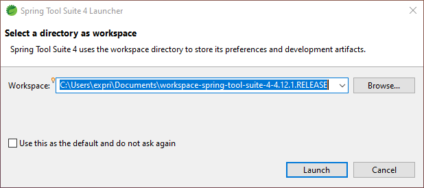
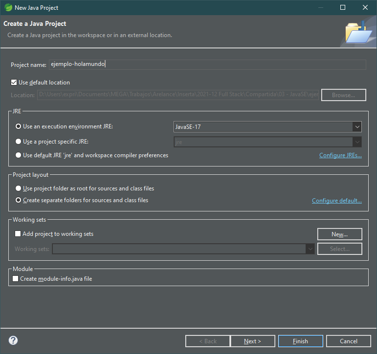
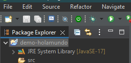
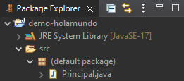
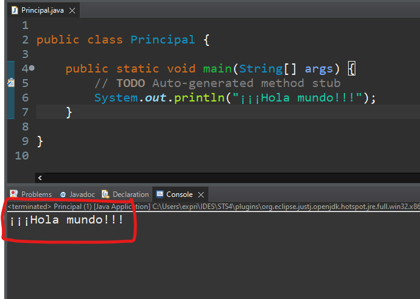

# Índice

[TOC]

------


# Instalación Spring Tool Suite

Normalmente para aprender Java se usa Eclipse. Si después queremos usar Spring Framework y Spring Boot, se usa una versión modificada de Eclipse llamada Spring Tool Suite. Como podemos usar Spring Tool Suite para todo lo que se verá en el curso, lo usaremos desde el principio y así tendremos el mismo IDE durante todo el curso, para ver JavaSE, JavaEE, Spring y Spring Boot. Además Spring Tool Suite trae la JDK y JRE de Java preinstalada y así no necesitamos instalar nada más, evitando problemas multiplataforma.

## Descargar

Encontraremos la última versión de Spring Tool Suite en la siguiente dirección:

https://spring.io/tools

## Descomprimir

**FORMA 1:** El IDE viene comprimido en un archivo `.jar`. Tendremos que ejecutarlo para que el archivo `.jar` empiece a auto descomprimirse. Para ejecutarlo, en la carpeta donde tengamos el archivo, escribimos en la consola el siguiente comando:

```bash
java -jar [nombre del archivo descargado].jar
```

> **Nota:** Deberemos tener instalada la JDK de Java y el path correctamente configurado para que funcione directamente en la línea de comandos. O bien poner las rutas absolutas del archivo java.exe y el archivo.jar.

**FORMA 2 (recomendada):** También podemos abrir el archivo `.jar` con [7zip](http://www.7zip.org) u otro gestor de archivos comprimidos (winzip, winrar) y descomprimir el archivo `contents.zip` de su interior y proceder a su extracción normal. 

Obtendremos una carpeta llamada `/sts-4.x.x.RELEASE`. La podremos mover a la ubicación que deseemos ya que es una versión portable que ya trae una JDK open source lista para empezar.

## Puesta en marcha

Para arrancar la aplicación deberemos ejecutar el archivo `SpringToolSuite4.exe` que hay en la carpeta final. La primera vez que arrancamos STS nos preguntará la ubicación de nuestro directorio de trabajo (*workspace*). 



Podemos seleccionar que use la ruta indicada como ruta por defecto y ya no nos volverá a preguntar. Siempre podremos cambiar esto más adelante.

### Preferencias recomendadas

Entraremos en *Window -> Preferences*, y ahí:

- **Tema oscuro:** Cansa menos la vista. *General -> Appearance -> Theme Dark*.
- **Corrector ortográfico:** Por defecto ya está activado y en inglés. Podemos añadirle un diccionario manualmente en *General -> Editors -> Text Editors -> Spelling -> Dictionaries -> Browse ->* Y elegimos el diccionario en español que podemos [descargar de aquí](https://github.com/borilio/curso-javase/tree/master/assets/diccionario). Seleccionar la codificación UTF-8 para el diccionario para que funcione correctamente.
- **Auto Save**: Configurar que los archivos se vayan guardando automáticamente cada pocos segundos y nos evitaremos sorpresas. *General -> Editors -> Autosave -> Enable autosave* y le indicamos el intervalo en segundos.
- **Ampliar buffer de la consola:** Por defecto, la salida por consola viene con un buffer pequeño, el cual la primera vez que ejecutemos una aplicación, nos dará un aviso. Si lo arreglamos desde ya, no tendremos luego interrupciones. Vamos a *Run/Debug -> Console -> Marcamos "Limit console output" y establecemos "Console buffer size (characters)"* a un valor más alto, 1.000.000 aprox. También podemos desactivar el límite. No habría diferencia de rendimiento visible entre las dos opciones.


# Hola Mundo!

Una vez configurado el entorno, vamos a crear nuestra primera aplicación y hacerla funcionar, para asegurarnos que todo está bien instalado y no tendremos futuros problemas.

## Nuevo proyecto

Vamos a ver los pasos usando Spring Tool Suite 4.

1. Iniciamos el asistente con **File -> New -> Java project**

2. Sólo deberemos indicarle el nombre del proyecto en la casilla de “Project name”. Esto creará una carpeta con el mismo nombre en el workspace indicado previamente. En esa carpeta de ubicarán todos los archivos de nuestro proyecto. Se aconseja no usar caracteres especiales. Podemos usar por ejemplo `ejemplo-holamundo`.
3. Desactivamos la casilla de `Create module-info.java file`.
4. Pulsamos `Finish` y ya tendremos el proyecto creado. 


## Estructura de proyecto

Nos habrá creado una proyecto con la siguiente estructura:



Veremos primero las librerías del sistema de Java (JRE System Library), que no tendremos que tocar nada y una carpeta llamada `src` donde añadiremos todo nuestro código Java.

## Añadiendo código

Para crear nuestro primer archivo Java, pulsaremos **botón derecho del ratón sobre la carpeta `src`**, y seleccionamos *New -> Class*. Nos saldrá un asistente para crear una nueva clase Java (ya veremos más adelante con detenimiento qué es una clase).


En esta ventana, tan sólo le indicaremos el nombre de la clase en el cuadro “**Name**”. El nombre de una clase **SIEMPRE EMPIEZA CON LA PRIMERA LETRA EN MAYÚSCULA**, y el resto en minúsculas. Por ejemplo, nuestra clase se puede llamar `Principal`.

Le marcamos la opción `public static void main(String[] args)`. Ya se explicará más adelante. Y pulsamos **Finish**.



Esto nos creará el archivo `Principal.java` dentro del proyecto, con el siguiente contenido:

```java

public class Principal {

	public static void main(String[] args) {
		// TODO Auto-generated method stub
		
	}

}
```

Podemos añadir debajo del comentario la siguiente línea (en la línea 6):

```java
System.out.println("¡¡¡Hola Mundo!!!");
```

>  **Muy importante:** No podremos por ahora, escribir nada fuera de las llaves del método `main`. Todo se explicará en su debido momento ⏳, se paciente.

## Ejecutar la aplicación

En este punto, ya podemos pasar a ejecutar la aplicación. Tenemos varias formas de ejecutar una aplicación Java. Empecemos con una y después iremos viendo más.

1.  Pulsar **botón derecho sobre la carpeta de nuestro proyecto** (no sobre el archivo `Principal.java`, sino sobre la carpeta `demo-holamundo`). Nos aparecerá un menú contextual y seleccionamos ***Run As… -> Java Application***.
2. Veremos que nos aparecerá una ventana con la consola de Java. Ahí es dónde veremos el resultado de ejecutar nuestra aplicación Java.
