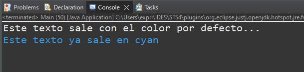
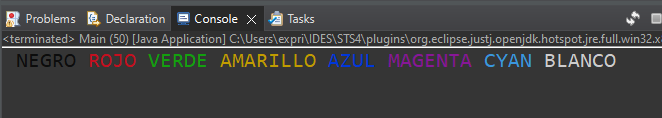

# Índice

[TOC]

------

# Introducción a Java

**Java es un lenguaje de programación orientado a objetos, multiplataforma, robusto y fuertemente tipado**. La plataforma Java proporciona, además de un  lenguaje de programación, todo un conjunto de especificaciones, tecnologías y librerías de clases, mediante los cuales se pueden crear diferentes tipos de programas informáticos capaces de ser ejecutados en una amplia variedad de sistemas operativos.

Esta independencia, tanto del sistema operativo como del dispositivo, ha contribuido a expandir el lenguaje, y a que numerosos fabricantes de software hayan apostado por el, y que a día de hoy siga siendo la principal opción para numerosas empresas y programadores a la hora realizar sus desarrollos.

# JDK y JRE

{{Próximamente}}

# Máquina Virtual de Java (JVM)

{{Próximamente}}

# Tipos de datos

Java es un lenguaje fuertemente tipado, y se ha de especificar los tipos de datos en la creación de variables, objetos, atributos, valores devueltos por los métodos y parámetros recibidos por los métodos. 

## Variables

En programación, una variable está formada por un espacio en memoria y un nombre simbólico, llamado **identificador**, que queda asociado a dicho espacio. En ese espacio se podrá almacenar un **valor**. Usaremos el identificador para hacer referencia al valor almacenado en memoria. El valor de la variable puede cambiar durante la ejecución del programa.

### Reglas para los identificadores

- Deben empezar por una letra y en minúscula. En Java se usa la notación camelCase.
- Pueden contener números, pero no podrán empezar por un número.
- No pueden usarse tildes, ni signos de puntuación, ni caracteres especiales.
- No podrán usarse palabras reservadas para el lenguaje.
- Identificadores válidos serían: `contador`, `contador3`, `c`, `x2`, `contadorVocales`.
- Identificadores no válidos serían: `1contador`, `123`, `c%`, `x-y`, `?min`, `año`, `spidermán`. (Realmente si funcionaría la ñ y las tildes, pero nos provocarán muchos errores futuros, así que mejor tratarlos como no válidos.)

Para **definir una variable** (también llamado declarar) de un tipo de dato concreto, se usará la sintaxis siguiente:

```
<tipoDeDato> identificador;
```

Para poder usar una variable (operar con ella, mostrar su valor, etc), Java nos obliga a darle un valor inicial. Esto se llama **inicializar**. Para asignar un valor a una variable ya declarada, usaremos el operador de asignación `=`.

```
identificador = valor;
```

También se puede hacer la **declaración e inicialización** en una misma sentencia:

```
<tipoDeDato> identificador = valor;
```

Veamos los primeros tipos de datos en Java, antes de poder definir una variable.

## Tipos primitivos

También llamados atómicos, puesto que son las unidades más pequeñas con las que podemos trabajar en Java. Los objetos estarán formados por otros objetos o bien por tipos primitivos. Los tipos primitivos en Java son:

| Nombre             | Declaración | Descripción                                                  | Memoria | Rango                                              |
| ------------------ | ----------- | ------------------------------------------------------------ | ------- | -------------------------------------------------- |
| Booleano           | `boolean`   | Define una variable que puede tomar dos posibles valores. `true` o `false`. | 1 bit   | `true` o `false`                                   |
| Byte               | `byte`      | Define una variable entera pequeña.                          | 1 byte  | [-128 ... 127]                                     |
| Short              | `short`     | Define una variable entera corta.                            | 2 bytes | [-32.768 … 32.767]                                 |
| Entero             | `int`       | Define una variable entera estándar. Suele ser la más usada para representar un número entero. | 4 bytes | [-2<sup>31</sup> ... 2<sup>31</sup>-1]             |
| Entero largo       | `long`      | Define una variable entera con un mayor rango, pero ocupa el doble en memoria. | 8 bytes | [-2<sup>63</sup> ... 2<sup>63</sup>-1]             |
| Decimal simple     | `float`     | Define una variable real estándar.                           | 4 bytes | [±3,4·10<sup>-38</sup> … ±3,4·10<sup>38</sup>]     |
| Decimal doble      | `double`    | Define una variable real con doble precisión. Ocupa el doble que `float` en memoria. | 8 bytes | [±1,7·10<sup>-308</sup> ... ±1,7·10<sup>308</sup>] |
| Carácter           | `char`      | Define una variable que podrá almacenar un único carácter o su código ASCII. Se delimita con comillas simples. Ejemplo: `'a'`. | 2 bytes | [0 .. 65.535]                                      |
| String<sup>1</sup> | `String`    | Defina una variable que podrá almacenar una cadena de caracteres. Se delimita con comillas dobles. Ejemplo: `"Hola Mundo"`. |         |                                                    |

> **Nota importante<sup>1</sup>:** El tipo de datos `String` NO ES una variable de tipo primitivo. Ya se verá más adelante a fondo. La incluimos aquí porque podemos catalogarla como **básica** e incluirla “moralmente” entre los tipos primitivos, aunque técnicamente no lo sea.

Una vez que ya hemos visto las variables, sus tipos de datos, y la sintaxis para declarar e inicializar variables, veamos nuestras primeras líneas de código real en Java, dónde definimos una variable de cada tipo:

```java
//Booleanas
boolean esCorrecto = true; 	//true o false

//Enteros
byte b = 127;				//entre -128 y 127
short s = 32767;			//entre -32768 y 32767
int i = 2147483647;			//tipo entero
long l = 2150000000L;		//tipo entero largo;

//Decimales
float f = (float) 7.5;		//tipo float (decimal con simple precisión)
double d = 9.573;			//tipo double (decimal con doble precisión)

//char
char letra1 = 'A';			//Los char se pueden tratar indistintamente como un carácter 
char letra2 = 65;			//o como un número
char letra3 = 'B' + 1;		//Esto NO DARÍA B1, si no 'C'

//String
String curso = "Desarrollador/a Fullstack"; //No sería un primitivo, pero casi ;)
```

## Literales

Se denominan **valores literales** a aquellos datos que son introducidos en el código del programa directamente en forma de constantes. Suelen usarse para asignar un valor inicial a una variable o como parte de una expresión aritmética o de otro tipo.

- `int a = 15;` –> **15** sería un literal de número. 
- `String cadena = "Hola Mundo!";` –> **Hola Mundo** sería un literal de String.

En Java, los literales también tienen su tipado, y siguen las siguientes reglas:

- Los literales numéricos, sean del tipo que sean, no se delimitan con ningún carácter.
- Los literales de números enteros, que no se definan explícitamente de un tipo, serán tomados como tipo `int`.
- Los literales de números decimales, que no se definan explícitamente de un tipo, serán SIEMPRE definidos como tipo `double`. 
- Los literales de cadenas, se delimitan por comillas dobles `""`.
- Los literales de carácter, se delimitan por comillas simples `''` ,  o bien por un número entero
- Los literales booleanos, serán `true` o `false`.

Los tipos de datos numéricos, siempre que no se pierda información, pueden “caber” en variables de tipo de dato de igual tipo o más grande, no necesitando ninguna conversión explícita. 

Si visualizamos el literal como un cajón, y la variable como una cajonera, entenderemos que nunca podremos guardar un cajón en una cajonera más pequeña, pero si al revés. Es decir, no podremos guardar un valor `double` dentro de una variable `float`, pero si podremos guardar un valor `int` en una variable `double` o `float`.

```java
int a = 15;    //El 15, es un entero, que se mete en una variable de tipo entero. Correcto.
float b = 3;   //El 3, es un entero, que se mete en una variable de tipo float. Correcto.
float c = 2.4; //El 2.4, es un DOUBLE, que se mete en una variable de tipo float. ERROR. No cabe.
```

### Conversiones explícitas

Si queremos guardar un literal decimal, en una variable de tipo `float`, deberemos convertir explícitamente el valor a `float`, ya que un literal decimal SIEMPRE será de tipo `double`, y no cabría en un `float`.

```java
float nota = (float) 8.3; //Así convertimos explícitamente el double a float (casting)
float temp = 25.8f;       //Así también, pero no se recomienda.
```

Para guardar un literal numérico en un `long`, que supere el rango de los enteros, deberemos convertir explícitamente también el número a `long`, ya que un número literal por defecto es de tipo `int`, y si este supera el rango permitido, dirá que nos estamos saliendo del  rango. Para convertirlo explícitamente, usaremos la letra `L` al final del número para indicar que es `long`.

```java
long largo = 3147000000L; 
```


### Conversiones implícitas

Son las conversiones producidas de forma automática por Java, sin que explícitamente indiquemos el tipo de dato resultante.

Veamos las más comunes:

Al dividir dos números de tipo entero, el resultado será de tipo entero y no de tipo decimal, sea cual sea la operación:

```java
int a=10;
System.out.println(a/2); //El resultado es -> 5
System.out.println(a/3); //El resultado es -> 3. No da 3.333333
```

Si queremos realizar una división que el resultado de decimales, deberemos usar en la expresión algún tipo de dato con decimales, como `float` o `double`, ya que tipo de dato del resultado de una expresión, será el tipo de dato mayor involucrado en la operación.

```java
int a=10;
System.out.println(a/2.0); //El resultado es -> 5.0
System.out.println(a/3.0); //El resultado es -> 3.3333333
```

En el ejemplo anterior, ambos resultados dan decimales, porque ya no estamos dividiendo un `int` entre un `int`, como antes, si no un `int` entre un `double` (recordar que un literal decimal SIEMPRE es `double`). Como resultado de la operación, el tipo de dato resultante será el mayor involucrado, para que no se pierda información en la operación.

Veamos otra posibilidad:

```java
float division1 = 5 / 2;		//Daría 2, y se guardaría 2.0
float division2 = 5 / 2.0;		//Error
float division3 = 5 / 2f;		//Funcionaría
float division4 = 5 / (float) 2;//Funcionaría
```

- Línea 1: Dividimos `5 / 2`, ambos enteros, el resultado es entero, y al guardarse en un `float`, se guardaría `2.0`.
- Línea 2: Dividimos `5 / 2.0`, un `int` entre un `double`, el resultado es `double`, por lo que no podemos almacenarlo en un `float`.
- Línea 3: Dividimos `5 / 2f`. Un `int` entre un `float`, el resultado es `float`, y se puede almacenar perfectamente en un `float`.

Con los String también tenemos conversiones implícitas:

**Para convertir de char a String:**

```java
char letra = 'Y';
String nif = "11223344" + letra; //Resultado -> "11223344Y"
```

Si concatenamos un `char` a un `String`, el resultado será `String`.

**Para convertir números (da igual el tipo) a String:**

```java
String nombre = "Max Power";
float cantidad = 3000;
System.out.println("Hola " + nombre + ", te queremos " + cantidad);
//Sale por pantalla -> "Hola Max Power, te queremos 3000"
```

En la expresión anterior, empezamos concatenando `"Hola " + nombre + ", te queremos "`. Sumamos 3 valores de `String`, que al concatenarlos obtenemos `Hola Max Power, te queremos `. Pero después le concatenamos un número. Ahí se hace una conversión implícita. El número se convierte a `String`, pasando de `3000 a "3000"`, y se concatena al resto del `String`. 

> **MUY IMPORTANTE:** Las expresiones, como en todos los lenguajes de programación, se resuelven de izquierda a derecha, teniendo máxima prioridad los paréntesis. Después las funciones, la multiplicación y división, y por último la suma y la resta.

Veamos como de importante es el orden en la resolución de una expresión:

```java
String cadena1 = "1" + 2 + 3;   //Resultado "123"
String cadena2 = 1 + 2 + "3";   //Resultado 1+2=3 -> 3 + "3" -> "33"
String cadena3 = 1 + (2 + "3"); //Resultado 2+"3"= "23" -> 1 + "23" -> "123"
String cadena4 = "1" + (2 + 3); //Resultado (2+3=5) -> "1" + 5 -> "15"
String cadena5 = 1 + 2 + 3;     //Daría error, no puede meter un int en un String
```


# Entrada y salida de datos

## Salida por pantalla

Para mostrar información por la consola, usaremos la función `System.out.println();`

```java
String saludo = "Hola Mundo!";
System.out.println(saludo);
```

Dicha función imprimirá el resultado de la expresión, y un salto de línea al final.

Hay una versión que no imprimirá ningún salto de línea al final, que es `System.out.print();`. 

También podemos incluir nosotros el salto de línea en la posición que queramos, incluyendo el carácter `\n` en cualquier parte del `String`.

```java
System.out.print("\nHola\nMundo");
```

Esto imprimirá por consola:

```
Hola
Mundo
```

### Colores  🌈

Es posible imprimir colores por la consola de Java en STS4. Tan sólo tendremos que imprimir un `String` concreto con un código de color y a partir de ese carácter imprimirá todo el texto en dicho color. A continuación la lista con los códigos de color y un ejemplo para imprimir un color concreto:

```java
//Lista de colores disponibles
String black = "\033[30m";
String red = "\033[31m"; 
String green = "\033[32m"; 
String yellow = "\033[33m"; 
String blue = "\033[34m"; 
String purple = "\033[35m"; 
String cyan = "\033[36m"; 
String white = "\033[37m";
String reset = "\u001B[0m";

System.out.print(reset); //Ponemos el color por defecto
System.out.println("Este texto sale con el color por defecto...");
System.out.print(blue); //A partir de aquí imprimimos en azul
System.out.print("Este texto ya sale en azul");
```
 

> **Nota:** Si cambiamos los colores, permanecerán activos hasta que se reseteen. Por lo que sería una buena práctica imprimir siempre al inicio del programa el color `\u001B[0m` (como hacemos en la línea 12 del ejemplo) para que no empezara a escribir con un color inesperado.

Aunque lo más fácil es guardar los códigos en variables para después imprimirlas cuando queramos, también podemos imprimir los códigos como parte de un String.

```java
System.out.print("\033[30m NEGRO");
System.out.print("\033[31m ROJO");
System.out.print("\033[32m VERDE");
System.out.print("\033[33m AMARILLO");
System.out.print("\033[34m AZUL");
System.out.print("\033[35m MAGENTA");
System.out.print("\033[36m CYAN");
System.out.print("\033[37m BLANCO");
```



También es posible cambiar el color de fondo y algunos estilos básicos como negrita o cursiva, aunque dependerá de la compatibilidad de la versión de Eclipse respecto a los códigos ANSI. 

La lista completa de códigos de escape para los colores ANSI la puedes encontrar en el siguiente enlace: https://en.wikipedia.org/wiki/ANSI_escape_code#Colors


## Entrada por teclado

Para leer datos desde teclado en un programa java, usaremos la clase `Scanner`. Primero instanciaremos un nuevo objeto de la clase `Scanner`.

```java
Scanner teclado = new Scanner(System.in); //Creamos un objeto Scanner
```

> **Nota:** La clase `Scanner` está en el paquete `java.util`. Deberemos importar el paquete para poder usar la clase.

Una vez creado el objeto Scanner, usaremos sus métodos para pedir el tipo de dato que necesitemos por teclado:

```java
int edad = teclado.nextInt();
float media = teclado.nextFloat();
double valor = teclado.nextDouble();
String nombre = teclado.nextLine();
```

Cada vez que llamemos a un método de los anteriores, la ejecución de la aplicación se detendrá y esperará a que introduzcamos un valor por la consola. Al pulsar intro se terminará la lectura por teclado, el valor recogido será devuelto por el método, y se asignará en la variable.

No es necesario crear nuevas instancias de la clase Scanner, podemos reutilizar la misma todas las veces que necesitemos. En nuestro ejemplo, es el objeto llamado `teclado`.

### Cerrar teclado

{{Pendiente}}

### Buffer de teclado

Al pedir datos por teclado, se van almacenando los caracteres pulsados en un *buffer* (memoria intermedia). Al usar los métodos `.nextInt()`, `.nextDouble()`, `.nextLine()`, etc., lo que hacen es extraer *tokens* (trozos) de ese buffer. 

Cada método extraerá lo que está buscando y lo devolverá. Pero tenemos un efecto curioso. Veamos la siguiente secuencia.

1. Al usar el método `.nextLine()`, se abre el buffer e introducimos `Max Power` y pulsamos intro, por lo que en el buffer habrá <kbd>Max Power\n</kbd>. El método extraerá todos los caracteres que encuentre hasta el `/n` y los devolverá en formato `String`.
1. Hasta aquí todo normal y controlado. Pero pidamos ahora un número.
2. Al usar el método `.nextInt()` (o cualquiera para números), se abre el buffer e introducimos `1234` y pulsamos intro, en el buffer habrá <kbd>1234\n</kbd>. El método extrae el siguiente número que encuentre en el buffer y lo devuelve con el tipo pedido (`int`, `double` o `float`). **Dejando el resto del buffer intacto**. Es decir, dejaría en su interior un <kbd>\n</kbd> residual.
3. Si en el buffer queda un <kbd>\n</kbd>, y volvemos a hacer un `.nextLine()`, tendremos un efecto inesperado. El método irá al buffer y como no está vacío, no se detiene a pedirnos nada, extrae el <kbd>\n</kbd> y sigue con la ejecución del programa.

**Problema:** Resumiendo, **después de hacer** un `.nextInt()`, `.nextDouble()` o `.nextFloat()`, **si hacemos un** `.nextLine()`, el primero lo ignorará (los sucesivos si funcionarán). Si primero pedimos el `.nextLine()` y después el `.nextInt/Float/Double()`, no existirá problemas, por lo explicado anteriormente.

**Solución:** Si pedimos un número, y después queremos pedir un String (es importante que sea en ese orden), necesitaremos limpiar el buffer tras pedir el número, haciendo:

```java
teclado.nextLine();
```

No es necesario que guardemos el resultado en ninguna variable (podemos dejar que se vaya al cielo de los `String`). Ejecutando esa línea, cuando hagamos el `.nextLine()` que necesitemos, se detendrá como debe, ya que el buffer estará vacío.

Aquí un ejemplo de todo lo explicado, secuencialmente:

```java
Scanner teclado = new Scanner(System.in);
System.out.println("Introduce tu edad y tu nombre, en ese orden:");
int edad = teclado.nextInt();  		//Se detiene para introducir una edad
String nombre = teclado.nextLine();	//Se lo salta, porque en el buffer quedó un \n de antes
String apodo = teclado.nextLine();	//Se detiene, porque el buffer ya se vació en la línea anterior
```

Y como podemos solucionarlo:

```java
Scanner teclado = new Scanner(System.in);
System.out.println("Introduce tu edad y tu nombre, en ese orden:");
int edad = teclado.nextInt();  		//Se detiene para introducir una edad
teclado.nextLine();					//Limpiamos el buffer, ya que había un \n
String nombre = teclado.nextLine();	//Se detiene, porque el buffer ya está vacío
String apodo = teclado.nextLine();	//Se detiene de nuevo, porque el buffer está vacío
```

> **🤓:** También podemos solucionarlo pidiendo los `String` en primer lugar, y después los números. O bien usando una nueva instancia de la clase `Scanner`, la cual tenga un buffer vacío.

