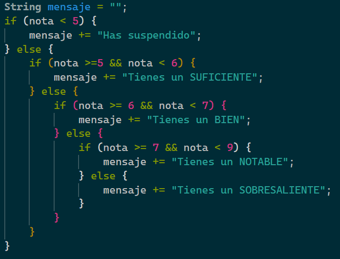

# Índice

[TOC]

------

# Tipos de instrucciones

Cada línea que escribimos en un programa es una instrucción. Estas instrucciones pueden ser:

- **Declaraciones:** Sirven para definir (crear) una variable o funciones en un programa.
- **Primitivas**: Son acciones sobre los datos de los programas. A su vez puede ser:
  - **De asignación:** Cuando asignamos un valor a una variable.
  - **De Entrada o Salida (E/S):** Cuando mostramos una expresión por pantalla o leemos por teclado. La pantalla y el teclado son las E/S estándar, pero podría ser cualquier otro dispositivo.
- **Control:** Sirven para alterar y controlar el orden de ejecución de un programa. En general, todos los programas se ejecutan secuencialmente línea a línea, y gracias a estas estructuras el flujo del programa puede depender de ciertas condiciones que nosotros elijamos.


Ejemplo de instrucción de declaración:

```java
String curso = "Java";
```

Ejemplo de instrucción de asignación:

```java
curso = curso + "SE por Salva Márquez";
```

Ejemplo de instrucciones de E/S:

```java
System.out.print("Introduzca su edad: ");	//Instrucción de SALIDA
int edad = scanner.nextInt();				//Instrucción de ENTRADA
```

Ejemplo de instrucción de control:

```java
//Si la expresión es verdadera, se ejecuta la primera sentencia
//en caso contrario, la segunda.
if (gremlinBueno == true && hora > 23) {
    System.out.println("No es hora de comer"); 
} else {
    System.out.println("Puedes comer un poquito");
}
```

Veamos a fondo las distintas instrucciones de control en Java en el siguiente apartado.

# Instrucciones de control

Todas las instrucciones anteriormente vistas, son secuenciales. Se ejecutan una tras otra y en ningún momento se varia el flujo del programa. Pero la programación estructurada permite el uso de condiciones y de iteraciones.

Estas instrucciones permiten que ciertas líneas de código se ejecuten o no, dependiendo de una condición (**instrucciones condicionales**), e incluso repetidamente hasta o mientras se cumpla una condición (**instrucciones repetitivas**). En definitiva son instrucciones que permiten variar el flujo normal del programa.

## Expresiones lógicas

Para variar el flujo, usaremos condiciones que decidirán si se modifica o no el flujo, saltando bloques de código o repitiéndolos. Una condición es una **expresión lógica** o **booleana**. 

Una expresión lógica es una operación donde el resultado siempre será un valor lógico, verdadero o falso. Nunca dará cualquier otro resultado. En java los valores serán `true` o `false`. 

Suelen ser comparaciones entre datos. Por ejemplo, `5 > 8`, da como resultado `false`. `"Hola" == "Ola"` da como resultado `false`. De la misma forma que `1+(1*3)/8` es una expresión matemática, y su resultado será un número, en una expresión lógica su resultado deberá ser `true` o `false`.

Para “operar” en una expresión lógica en java, usaremos los siguientes operadores en Java:

- `>` Mayor que
- `<` Menor que
- `>=` Mayor o igual que
- `<=` Menor o igual que
- `==` Igual que
- `!=` Distinto que
- `&&` Y (and)
- `||` O (or)
- `!` No (not)


## Instrucción condicional simple

Se crea con la instrucción <kbd>if</kbd>. Evalúa una expresión lógica y dependiendo del resultado, ejecuta un bloque de instrucciones o no. 

**Sintaxis:**

```java
if (condicion) {
    instrucción1;
    instruccion2;
    ...
}
```

**Ejemplo:**

```java
//Ejemplo de instrucción IF
if (hora >= 7 && hora <= 11 ) {
    System.out.println("Buenos días");
    saludo++;
}
```

Dependiendo del valor de la variable `hora`, se ejecutarán las instrucciones delimitadas por las llaves `{ … }`, también llamado **bloque**. Se evalúa la expresión entre los paréntesis `(…)`, si el resultado es `true`, se ejecutan las líneas 3 y 4. Si el resultado es `false`, se ignorará todo el bloque y la ejecución seguirá por la línea 5.

La condición podrá ser más simple o más compleja, pero su resultado deberá ser siempre `true` o `false`.

La primera instrucción que va dentro de un bloque, empieza con un espaciado hacia la derecha con la tecla `tab`. Todas las instrucciones siguientes irán debajo al mismo nivel. Esto nos ayudará a identificar rápidamente las instrucciones que están dentro de un bloque y las que no. A este proceso se la llama **indentación**. Aunque el programa compilará exactamente igual si se cumple esta norma o no, es de suma importancia respetar la indentación.

## Instrucción condicional doble

Se crea con la instrucción <kbd>if … else</kbd>. Es una variante del condicional simple, en la que se ejecutan unas instrucciones si la expresión da `true`, y otras instrucciones si es `false`. En la condicional simple no se ejecuta ningún bloque concreto de instrucciones en caso de que el resultado sea `false`.

**Sintaxis:**

```java
if (condicion) {
    instrucciones si true;
    ...
} else {
    instrucciones si false;
    ...
}
```

**Ejemplo:**

```java
if (hora >= 7 && hora <= 20 ) {
    System.out.println("Buenos días");
    buenosDias++;
} else {
    System.out.println("Buenas noches");
	buenasNoches++;
}
```

Dependiendo del valor de la variable `hora`, si está entre los valores 7 y 20, se imprimirá por pantalla `"Buenos días"`, en cualquier otro caso, `"Buenas noches"`. 

El bloque `else` de una instrucción de tipo `if` es opcional. Cada bloque de instrucciones tiene sus propias llaves, y aunque se puedan escribir con otra sintaxis (por ejemplo, escribir todas las llaves al inicio de la línea), se aconseja que se use tal cual está en el ejemplo.

Hay que tener en cuenta que se pueden incluir instrucciones `if` unas dentro de otras. A eso se le llaman **if anidados**.

```java
String mensaje = "";
if (nota < 5) {
    mensaje += "Has suspendido";
} else {
    if (nota >=5 && nota < 6) {
        mensaje += "Tienes un SUFICIENTE";
    } else {
        if (nota >= 6 && nota < 7) {
        	mensaje += "Tienes un BIEN";
        } else {
            if (nota >= 7 && nota < 9) {
                mensaje += "Tienes un NOTABLE";
            } else {
                mensaje += "Tienes un SOBRESALIENTE";
            }
        }
    }
}
```

Al anidar estas instrucciones hay que tener en cuenta que habrá que cerrar los bloques interiores antes que los exteriores. Hay IDEs que nos ayudan, por ejemplo con líneas verticales para mantener la indentación, o usando colores distintos para las llaves de distintos bloques.




## Instrucción condicional compuesta

Se crea con la instrucción <kbd>switch</kbd>. En muchas ocasiones hay que valorar expresiones que como resultado pueden dar muchos valores distintos, no sólo verdadero o falso. Se pueden hacer instrucciones `if` anidadas, pero para estos casos existe una instrucción que evalúa una expresión (matemática o lógica) y según los diferentes valores que toma se ejecutan unas u otras instrucciones. Su funcionamiento sería el siguiente:

**Sintaxis:**

```java
switch (expresión) {
    case valor1:
        instrucciones;
        ...
		break;
    case valor2: 
        ...
		break;
    default:
        instrucciones en otro caso;
        ...
}
```

**Ejemplo:**

```java
int diaNumero = 5;
String diaPalabra;
switch (diaNumero) {
    case 1:
        diaPalabra = "Lunes";
        break;
    case 2:
        diaPalabra = "Martes";
        break;  
    case 3:
        diaPalabra = "Miércoles";
        break;
    case 4:
        diaPalabra = "Jueves";
        break;
    case 5:
        diaPalabra = "Viernes";
        break;
    case 6:
    case 7: 
        diaPalabra = "Fin de semana";
        break;
    default:
        diaPalabra = "Error: No es un día de la semana válido";
}
System.out.println("Su cita será el " + diaPalabra);
```

Lo que hace la instrucción `switch`, es evaluar la variable `diaNumero`, y dependiendo de su valor, entra en cada sección `case` y ejecuta las instrucciones de su interior. Tenemos que forzar la salida de cada sección con la instrucción `break`, la cual sale del bloque en el que esté, así evitando que se ejecuten las sentencias del siguiente `case`.

En el caso 6 y 7, no ponemos el `break` a conciencia, para que en caso de que `diaNumero` valga `6` ó `7`, ejecutará `diaPalabra = "Fin de semana";`, sin  tener que repetir las instrucciones en ambos casos. 

El `default` actúa como un `else`, es decir, si `diaNumero` tiene un valor que no hemos contemplado en ningún `case`, se ejecutará las sentencias de la sección `default`.

Con `switch` nos ahorramos unos cuantos `if` anidados, obteniendo así una estructura más flexible para poder ampliarla y más legible.

## Instrucción repetitiva While

Se crea con la instrucción <kbd>while</kbd>. Ejecuta un bloque se instrucciones **mientras** la condición evaluada sea verdadera. Cuando la condición sea falsa, el bucle terminará y dejará de ejecutarse. **La condición se evalúa antes de entrar**.

**Sintaxis:**

```java
while (condición) {
    instrucciones;
    ...
}
```

**Ejemplo:**

```java
int x=0;
while (x<10) {
    System.out.println(x);
    x++;
}
```

1. Primero inicializamos la variable `x` al valor `0`. 
2. Evaluamos la expresión `x<10`. Si su valor es `true`, entramos en el bucle, si no salta todas las instrucciones y seguiría por la línea 5 (o punto 6 de esta lista).
3. Imprimimos el valor de `x`.
4. Sumamos un 1 a `x`.
5. Y volvemos al punto 2.
6. Fin.

El bucle nos imprimiría los números del 0 al 9 sin tener que escribir la línea 10 veces. 

> **Importante:** Las instrucciones del bloque `while` podrían incluso no llegar a ejecutarse nunca, si la condición es `false` inicialmente.


## Instrucción repetitiva Do… While

Se crea con la instrucción <kbd>do…while</kbd>. Es una variante del bucle `while`, donde la única diferencia es el momento en el que se evalúa la condición. Aquí **la condición es evaluada al final** del bloque de instrucciones y no al principio, con lo que nos aseguramos que en el bucle entrará al menos una vez.

**Sintaxis:**

```java
do {
    instrucciones;
    ...
} while (condición);
```

**Ejemplo:** 

```java
Scanner teclado = new Scanner(System.in);
System.out.println("Introduce una opción (1-6): ")
int opcion;
do {
	opcion = teclado.nextInt();
} while (opcion < 1 || opcion > 6);
```

Mientras la opción sea distinto a un número entre 1 y 6, se estará ejecutando el bloque de instrucciones. Aquí la ventaja es que podemos evaluar la condición DESPUÉS de pedirla. Lo natural es pedir la opción y después decidir si tenemos que repetir, por lo que el `do…while` sería más apropiado que un `while`. 

Con un while normal, al evaluar la condición ANTES de entrar en el bucle, deberíamos pedir el número antes de entrar y después volverlo a pedir en caso de que no cumpliese la condición dada.

> **Importante:** Con un `do…while` nos aseguramos que el bloque de instrucciones se ejecuten al menos una vez. Lo cual es más apropiado para validar datos pedidos por teclado, ya que no podemos evaluarlos antes de pedirlos. Cuestión del espacio -tiempo. 

## Instrucción repetitiva For

Se crea con la instrucción <kbd>for</kbd>. Es otra variante del `while` que lleva ya un contador incorporado. Al ser una estructura muy repetida (un bucle con un contador), esta instrucción nos ahorra tiempo haciendo la tarea básica de inicializar al empezar, e incrementar en cada iteración.

**Sintaxis:**

```java
for (inicialización; condición; incremento) {
    instrucciones;
    ...
}
```

**Ejemplo:**

```java
//Tabla del 5
for (int i=0; i<=10; i++){
    System.out.println("5 x" + i + " = " + (5*i));
}
```

 El bucle hace lo siguiente:

1. Declarar una variable `i`, e inicializarla a `0`. 
2. Comprueba la condición `i<=10`. Mientras sea verdadera, entra en el bucle. Si es falsa, no entra y se salta todo el bloque de instrucciones. Exactamente igual que un `while`.
3. Ejecuta las instrucciones que haya en el bucle.
4. Ejecuta la instrucción de incremento que hemos definido en el bucle. `i++` en nuestro ejemplo.
5. Y vuelve al punto 2. Cuando la condición sea falsa, saldrá del bucle.

> **Importante:** Es una mala práctica modificar manualmente el índice el bucle para forzar su salida. Si queremos salir por otra razón que no sea el índice, deberíamos usar otro tipo bucle.

## Instrucciones anidadas

Todas las instrucciones se pueden anidar dentro de otras. Cualquier combinación. No hay límites. Tan sólo deberemos cerrar en orden los bloques y usar la sintaxis correctamente.
