# Índice

[TOC]

------

# Introducción

En los inicios de la programación ya se observaron los problemas que conlleva el hecho de programar sin un análisis previo. Los arreglos en el código costaban miles de horas y provocaban la generación de código casi ilegible. La primera técnica de programación que intentaba paliar estos problemas fue la programación estructurada, que permite escribir programas con un código más claro y legible, lo que permite una fácil modificación del mismo. En esta programación todo el código se escribía utilizando las estructuras `if` y `while`.

Aunque mejoró la creación de código, el problema siguiente se planteó cuando los programas alcanzaron una extensión de miles o millones de líneas de código. Ante semejante cantidad de datos, la organización de los programas era casi imposible. La respuesta fue **la programación modular** que permite dividir el código en diferentes módulos (o funciones) cada una dedicada a un fin. Eso permite que cada módulo se programe de forma independiente al resto facilitando el mantenimiento y funcionamiento del código.

Pero la informática moderna trajo consigo aplicaciones de gran envergadura con elementos gráficos interaccionando entre sí de forma independiente. Eso no lo pudo resolver la programación modular. Se necesitan módulos más integrados e independientes, para poder ser utilizados incluso en aplicaciones diferentes. A esos nuevos módulos más independientes y eficientes es a lo que se le llama **objetos**.

**Un objeto es un elemento distinguible en una aplicación**, puede ser algo perfectamente distintivo en ella (un botón) o algo más abstracto (un error de programa).

## Objetos

**Un objeto es un elemento que agrupa atributos (variables) y métodos (funciones).** Por ejemplo en el caso de un objeto que represente un perro, dicho objeto posee datos (llamados atributos) como la edad, el nombre, el tamaño, etc. y funciones (llamados métodos) como ladrar, correr, etc.

En la POO una aplicación se entiende como una serie de objetos que se relacionan entre sí. Cada objeto responde a una programación previamente realizada; esta programación se realiza de forma independiente, eso nos asegura que el objeto es reutilizable (se puede usar en aplicaciones distintas).

## Clases

Antes de poder utilizar un objeto, se debe definir su clase. **La clase es la definición de un tipo de objeto.** Al definir una clase lo que se hace es indicar como funciona un determinado tipo de objetos. Luego, a partir de la clase, podremos crear objetos de esa clase.

Podemos decir que la clase es como el molde o el plano con el que se crearán todos los objetos de una clase.


> 🤓 A las clases Java, en inglés también se les llama *blueprint*, que significa plano.

Por ejemplo, si quisiéramos crear el juego del parchís en Java, una clase sería la casilla, otra las fichas, otra el dado, etc., etc. En el caso de la casilla, se definiría la clase para indicar su funcionamiento y sus propiedades, y luego se crearía tantos objetos casilla como casillas tenga el juego. Lo mismo ocurriría con las fichas, la clase ficha definiría las propiedades de la ficha (color y posición por ejemplo) y su funcionamiento mediante sus métodos (por ejemplo un método sería mover, otro llegar a la meta, etc.), luego se crearían tantos objetos ficha, como fichas tenga el juego.

Normalmente las clases representan cosas como:

- Cosas tangibles del mundo real: sillas, libros, coches, etc.
- Roles de las personas: socios, clientes, estudiantes, etc.
- Cosas no tangibles: un error, una transacción, un listado, un botón, etc.

## Diferencia entre clase y objeto

Una clase define el funcionamiento de los objetos. Es decir, la clase es la plantilla que cumplen todos los objetos de esa clase. De otra forma, la clase marca el tipo de objeto. Más exactamente marca la *idea* de objeto.

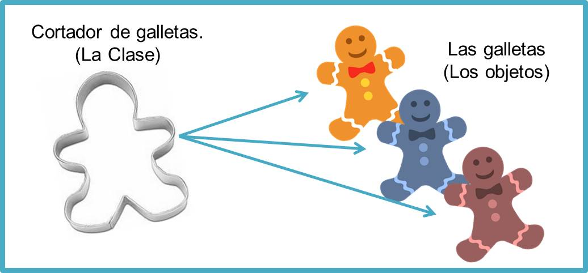

Por ejemplo, la clase ***Coche*** definiría la idea o modelo general de coche que tenemos en la cabeza. Esa idea abarca a todos los coches; en esa idea está el hecho de que los coches tienen cuatro ruedas, motor, consumen combustible, aceleran, frenan,… Sin embargo si miramos por la ventana y vemos un coche, ese coche no es ya una clase, **es un objeto**. Un objeto de la clase Coche.

Suele usarse la palabra **instancia** para referirnos a un objeto creado de una clase. Por ejemplo, el objeto `seat` es una instancia de la clase `Coche`.

## Diagramas UML

UML es la abreviatura de *Universal Modelling Language* (Lenguaje De Modelado Universal), que define una serie de esquemas diseñados para facilitar la tarea de diseñar aplicaciones informáticas.

El organismo responsable de UML es el OMG (Objects Management Group, Grupo de Administración de Objetos) que es un organismo sin ánimo de lucro que pretende estandarizar la programación orientada a objetos. El diagrama UML que permite representar clases se llama precisamente **diagrama de clases** y se representa de la siguiente forma:

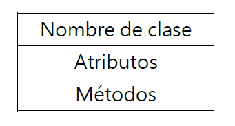

**Para indicar los atributos**, se pone el nombre del atributo seguido de dos puntos y el tipo de datos del atributo (el tipo de datos se suele indicar de forma conceptual: entero, cadena, lógico, etc).

**Para indicar los métodos**, se indicaría el nombre, los parámetros recibidos y el tipo de dato de los mismos. También podría indicarse el tipo de valor devuelto por el método, si es que retornase algún valor.

Un ejemplo de una representación de la clase coche usando UML para el diagrama de clases sería:

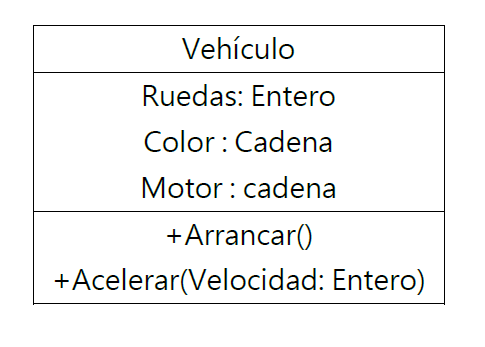

## Ejemplo en Java

### Nomenclatura en Java

Los identificadores que usamos para hacer referencia a las clases, objetos, atributos y métodos, siguen una nomenclatura. Hay que cumplir las siguientes normas:

- **Siempre usaremos camelCase**. Quiere decir que se escribe en minúscula (salvo excepciones) y separamos las palabras escribiendo la primera letra de cada palabra en mayúscula. Ejemplo: `jugadorFutbol`, `mediaAritmetica`, `calculoSueldosParciales`.
- **Las clases SIEMPRE empiezan por una letra mayúscula**, y el resto usando camelCase. Ejemplo: `Vehiculo`, `AndroideAsesino`, `CasillasJuego`. 
- Los identificadores de atributos, objetos y métodos, siguen las mismas reglas que las variables. Empiezan en minúscula y se usa camelCase.
- **Las constantes se escriben todas en mayúsculas**, usando snake_case. Esto es usando un guion bajo para separar palabras. Ejemplo: `COLOR_ROJO`, `ROL_USUARIO`, `PI`.
- Los paquetes se escriben siempre TODO en minúsculas.

La realidad es que todas estas normas son convenciones que se han establecido, pero realmente funcionará todo igualmente si no las cumplimos. Por ahora. Cuando usemos un framework como Spring, estas normas si serán obligatorias ya que se esperará que ciertos métodos o atributos estén nombrados siguiendo las normas descritas. Además, si todos seguimos las mismas normas, mejorará la legibilidad del código.


### Creación de una clase

En Java, las clases se escriben, usando la siguiente sintaxis:

```java
//Archivo Vehiculo.java
public class Vehiculo {
    //Atributos
    public int ruedas;
    public String color;
    public String motor;
    
    //Métodos
    public void arrancar() {
        ...
    }
    
    public boolean acelerar(int velocidad) {
        ...
    }
    
}
```

> **⚠️Importante: ** El identificador que usemos en la clase debe coincidir con el nombre del archivo .java donde guardaremos el código. Cada clase se guardará en un archivo diferente.

Primero se declaran los **atributos** sin inicializar, y después los **métodos**. En ambos (por ahora), se antepone la palabra `public`, que es un **modificador de acceso**, que se explicarán en detalle más adelante.


### Creación de un objeto

Una vez definida la clase, podemos ya **instanciar** un objeto. Veamos un ejemplo de como crear un objeto de la clase Vehículo anterior:

```java
Vehiculo coche = new Vehiculo();
```

- En primer lugar, el nombre de la clase (o tipo de la variable que vamos a crear), seguido del nombre del nuevo objeto. Hasta aquí estamos definiendo el objeto, pero no está inicializado. 
- Para inicializarlo, usamos el operador `new`, seguido del nombre de la clase y unos paréntesis `()`. Esto último es el *constructor*. Lo veremos más adelante.

Veamos un poco más…

```java
public class Main {
    public static void main (String[] args) {
        //Instanciamos un objeto de la clase Vehículo
        Vehiculo coche = new Vehiculo();
        //Le damos valores a sus atributos
        coche.ruedas = 4;
        coche.color = "Verde";
        coche.motor = "TDI 2.1";
        //Usamos sus métodos
        coche.arrancar();
        System.out.println("Aceleramos: " + coche.acelerar(10));
    }
}
```

- Ahora, para acceder a los atributos del objeto, se escribe el nombre del objeto seguido de un punto, y el propio IDE nos mostrará una lista con todos los atributos y métodos disponibles.
- Tendremos acceso a los atributos y podemos usar como variables normales, asignándoles valores que sean del mismo tipo del que se han definido.
- También tendremos acceso a los métodos, de igual forma que a los atributos. 

En esencia, tenemos variables y funciones exactamente igual que en la programación estructurada, pero ahora están “dentro” de un objeto.

- Los atributos son variables y se usan exactamente igual que si fueran variables independientes. Por ahora 😉.
- Los métodos son funciones. Pueden retornar valores o no, y pueden recibir parámetros o no. En el ejemplo el método `.arrancar()` no recibe parámetros ni retorna nada, y el método `.acelerar()` recibe un entero, y retorna un booleano, y eso es lo que imprimiremos por pantalla.

### Constructores

Los constructores son **métodos especiales destinados a inicializar los atributos** de los objetos en el momento de la creación. Su sintaxis es: Se pone el modificador de acceso `public` y seguido del nombre de la clase (empezando por mayúscula) y se ponen los paréntesis como en cualquier método.

```java
public Vehiculo() {
    ruedas = 4;
    color = "Azul eléctrico";
    motor = "SDI 1.9";
}
```

Así, todos los objetos creados usando el constructor que no recibe ningún parámetro, **llamado constructor por defecto**, tendrá los atributos ya inicializados a los valores deseados.

Si queremos pasarle unos valores concretos al constructor, se lo podemos pasar como parámetros (recordemos los constructores son métodos), y podemos asignarles a los atributos los valores recibidos por parámetros.

```java
public Vehiculo(int ruedasRecibidas, String colorRecibido, String motorRecibido) {
    ruedas = ruedasRecibidas;
    color = colorRecibido;
    motor = motorRecibido;
}
```

Ahora para crear el objeto, tendremos dos opciones, podemos usar el constructor por defecto, o el constructor con parámetros, dependiendo de los valores que queramos en el nuevo objeto.

```java
Vehiculo seatAzul = new Vehiculo(); //Tendrá los valores por defecto, 4, Azul eléctrico y SDI 1.9
Vehiculo pandaRojo = new Vehiculo(4, "Rojo", "Gasolina 2cv"); //Tendrá los valores recibidos
```

Podemos crear tantos constructores como necesitemos, con las combinaciones que queramos. Hasta incluso podemos no crear ningún constructor (como en el primer ejemplo). Si en una clase, no le añadimos ningún constructor, la JVM incluirá un constructor por defecto vacío para que podamos crear objetos de dicha clase. 

> **Importante:** Se añadirá un constructor por defecto únicamente si NO TENEMOS NINGUNO. Si le creamos un constructor (o más de uno), sea el que sea, la clase tendrá ESE constructor(es) y la JVM no nos incluirá nada.  

# Características

Java es un lenguaje de programación totalmente orientado a objetos, lo que significa que todos los conceptos definidos por este paradigma de programación son aplicables a este lenguaje.

Analizaremos las características de la POO, su implementación en Java, y las ventajas que su uso nos proporciona en el desarrollo de aplicaciones, no sólo a la hora de crear nuestras propias jerarquías de clases, si no también, y más importante, de cara a usar adecuadamente las clases e interfaces del API de Java para construir ciertos tipos de aplicaciones.

Los conceptos que trataremos serán los siguientes:

- **Abstracción**
- **Encapsulación**
- **Herencia**
- **Sobrescritura de métodos**
- **Sobrecarga de métodos**
- **Polimorfismo**

## Abstracción

La abstracción es como se pueden representar los objetos en modo de código. Es un método por el cual “extraemos” una determinada entidad de la realidad así como las características y funciones que desempeñan. Estos son representados en clases por medio de atributos y métodos de dicha clase.

Un ejemplo sencillo para comprender este concepto sería la abstracción de un Automóvil. Vamos a sacar de esta entidad sus características por ejemplo: color, año de fabricación, modelo, etc. Y ahora sacamos sus métodos o funciones típicas de esta entidad como por ejemplo: frenar, encender, etc. A esto se le llama abstracción.

Podemos decir de alguna forma, que la **abstracción es ponerle límites al objeto que queremos crear**, centrándonos en los atributos que necesitamos, y obviando los innecesarios o irrelevantes para nuestra tarea.

## Encapsulación

La encapsulación, aplicada al contexto de creación de una clase, es un concepto que se basa en **mantener aislados del exterior los atributos de la clase.** Para lograr esto, los atributos en lugar de usar el modificador `public` como hemos visto, ahora usaremos **`private`**, permitiendo que el acceso a los mismos sólo pueda realizarse desde el interior de la clase (desde sus propios métodos).

La encapsulación de los atributos es un mecanismo de protección de los datos pues, al impedir el acceso directo a los mismos desde el exterior de la clase, evitamos que se pueda asignar un valor inapropiado al atributo y dejar así al objeto en un estado inestable. Por ejemplo en el caso de la Clase Coche, con su atributo potencia, si no se protege el atributo declarándolo como privado, desde un código externo a la clase se podrá hacer algo como esto:

```java
coche1.potencia = -10; //Lo cual no tendría sentido
```

Ahora mismo, los atributos están disponibles tanto para lectura, como para escritura (como cualquier variable), al haber sido declarados como `public`.

De cara a proporcionar un acceso controlado desde el exterior a los atributos encapsulados por la clase, ésta debe disponer de unos métodos de tipo `get` y tipo `set` que permite realizar las operaciones de lectura y escritura sobre los atributos, respectivamente.

La nomenclatura de estos métodos, conocidos también como **métodos de propiedad**, sigue el convenio:

```
getNombreAtributo
setNombreAtributo
```

Donde `NombreAtributo` es el nombre que se asigna al método, que usaremos para acceder al atributo encapsulado, y que deberá coincidir con el nombre del atributo. Al usar camelCase, ahora se usará la palabra `get` o `set` (en minúscula) seguido del nombre del atributo empezando ahora por mayúscula.

Por ejemplo, para encapsular el atributo potencia en la clase Coche, y proporcionar un acceso controlado al mismo a través de los getter y setter, deberíamos escribir el siguiente código:

```java
public class Coche {
    //Atributo potencia
    private int potencia;

    //Getter del atributo potencia
    public int getPotencia(){
        return potencia;
    }

    //Setter del atributo potencia
    public void setPotencia(int valor){
        if (valor >= 0) {		//Así nunca tendrá valores negativos
            potencia = valor;
        }
    }
}
```

Podemos observar que ahora los atributos lo declaramos como `private`, de forma que ya desde el exterior de la clase **no podemos acceder a los atributos, pero si a los métodos**, ya que son `public`. Y ahora tenemos métodos por separado para acceder al atributo potencia para **obtener su valor** (getter), y otro para **modificar su valor** (setter). Pudiendo construirlos o no, para así dar acceso o no, a los atributos según nos convenga.

> **Nota:** Hay que tener claro, que el acceso a los atributos se lo limitamos desde el exterior de la clase según su modificador de acceso (`public` o `private`). Desde el interior de la clase, los atributos SIEMPRE podrán ser accesibles, sean cual sean su modificador de acceso.

Otra ventaja que nos proporciona la encapsulación está relacionada con evitar que los atributos tengan valores inestables (no deseados). Por ejemplo, podemos ver en el ejemplo anterior, que el *setter*, el atributo `potencia` solo se verá modificado en caso de que sea positivo, ignorando cualquier valor negativo recibido por parámetros. Antes eso era imposible, ya que al usar los atributos como variables, podíamos asignarles cualquier valor (dentro de su tipo) sin restricciones.

### Palabra reservada THIS

Desde el interior de la clase, podemos referirnos a los atributos directamente, ya que podemos entender que los atributos están declarados de forma global para toda la clase. Pero, ¿que pasaría si declaramos una variable en un método con el mismo nombre que un atributo?. Por ejemplo, en un constructor hacemos lo siguiente:

```java
private int ruedas;
private String color;
private String motor;

public Vehiculo(int ruedas, String color, String motor) {
    ruedas = ruedas; 
    color = color;
    motor = motor; 
}
```

En estos casos, Java no podría diferenciar si nos estamos refiriendo al nombre del parámetro o al nombre de los atributos. Una solución es cambiarle los nombres a los parámetros y así funcionaría (como hicimos al explicar los constructores). Pero esa solución dificulta la legibilidad y complicaría el código.

La solución es que para referirnos a los atributos y métodos de ESTA clase que estamos creando, se usa la palabra reservada <kbd>this</kbd>.

```java
public Vehiculo(int ruedas, String color, String motor) {
    this.ruedas = ruedas; 
    this.color = color;
    this.motor = motor; 
}
```

Así Java podrá diferenciar que con **`this.ruedas`**, nos estamos refiriendo al **atributo** de la clase, y con **`ruedas`** nos estamos refiriendo al **parámetro recibido**. 

Pasaría exactamente lo mismo si en lugar de un parámetro recibido fuera una variable declarada en el interior de un método. Usando el `this` diferenciamos entre una cosa y otra. 

Es una forma de hacer referencia al objeto antes de que este sea creado. Por esa razón usamos `this` y no el nombre del objeto. El objeto todavía no ha sido creado por lo que no tiene un identificador asignado.

> 💡 Recuerda, usando `this` referenciamos a ESTE objeto desde el interior de la clase. Y al escribir `this.` el IDE nos mostrará los atributos y métodos de la clase y podremos referenciarlos.


### Modificadores de acceso

En Java, los modificadores de acceso **son palabras clave utilizadas para controlar el nivel de acceso a las variables, métodos y clases** en un programa. Los modificadores de acceso permiten especificar quién puede acceder a una determinada parte de un programa. Los modificadores de acceso disponibles en Java son:

- `private`: Este modificador de acceso indica que el miembro de la clase solo puede ser accedido por miembros de la misma clase.
- `default` (sin modificador): Este modificador de acceso indica que el miembro de la clase puede ser accedido por miembros que estén en el mismo paquete.
- `protected`: Este modificador de acceso indica que el miembro de la clase puede ser accedido por miembros del mismo paquete y por cualquier subclase de la clase (esté en el paquete que esté).
- `public`: Este modificador de acceso indica que el miembro de la clase puede ser accedido desde cualquier lugar del programa.

> **⚠️Importante**: por defecto, todos los miembros de una clase (variables, métodos, constructores, etc.) son de acceso `default` (sin modificador) a menos que se especifique explícitamente un modificador de acceso.

Los modificadores de acceso se utilizan para proteger los miembros de una clase de ser modificados o accedidos de forma no deseada, y para asegurar que solo los miembros apropiados de la clase puedan acceder a ellos. También se utilizan para controlar el alcance de las variables y métodos y para asegurar que las clases y objetos solo interactúen de manera segura y controlada.

A continuación una tabla resumen con los modificadores de acceso en Java:

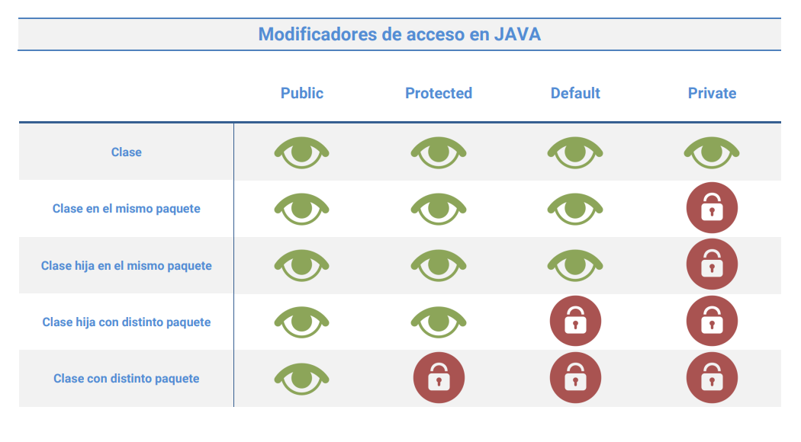

## Herencia

La herencia es quizá la característica más interesante y potente que ofrecen los lenguajes orientados a objetos. Mediante ella, es posible **crear clases que dispongan de forma automática de todos atributos y métodos definidos en clases ya existentes**.

Esto es particularmente útil en aquellos contextos dónde necesitamos utilizar una clase con los métodos incluidos en otra ya existente, pero a la que queremos añadir una nueva funcionalidad; en vez de modificar la clase original, emplearemos la herencia para crear una nueva clase con todos los métodos definidos en la primera y sobre ella incluir los nuevos elementos que se necesiten.

Como vemos, la herencia **representa un excelente mecanismo de reutilización de código**, incorporando en las nuevas clases los métodos definidos en otras sin tener que reescribirlos de nuevo.

La relación de herencia entre dos clases se expresa mediante una flecha que sale DESDE la clase que hereda, conocida también como **subclase**, y que apunta a la clase heredada, llamada también **superclase**.

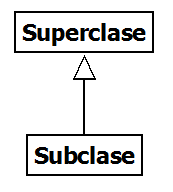

En la siguiente figura tenemos algunos ejemplos de clases relacionadas a través de la herencia.

| 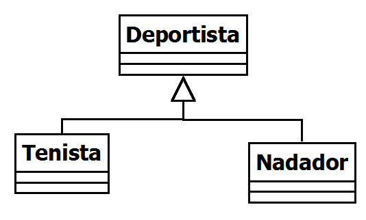 | 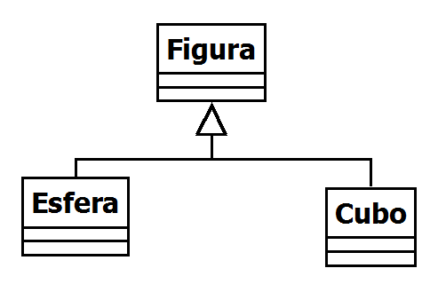 | 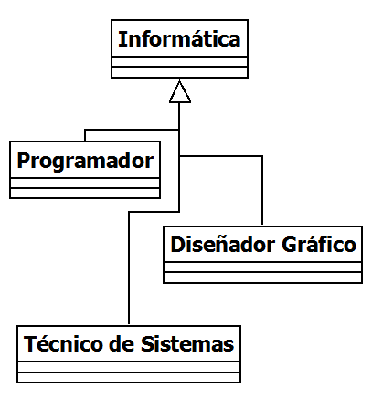 |
| :------------------------------------: | :--------------------------------: | :------------------------------------: |


En todos ellos, las superclases incluirían los miembros (atributos y métodos) generales comunes a determinadas familias de objetos, pudiendo añadir las subclases, los métodos y atributos específicos de cada tipo particular.

En este diagrama UML más específico, con la clase `Vehículo`, creamos una clase `Coche` que hereda de `Vehículo`.

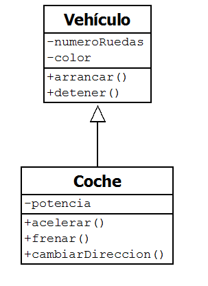

La clase `Vehículo` incluye atributos y métodos que son comunes para todo tipo de vehículo, como el color o el número de ruedas de éste, mientras que `Coche` añade características que son propias solamente de este tipo de vehículos, tales como la potencia o las operaciones de acelerado y frenado.

### Ejemplo en Java

Hemos visto la teoría. Pasemos a la práctica. Hagamos la clase anterior `Vehículo` y como haríamos que la clase `Coche` heredara los atributos y métodos de `Vehículo`.

```java
public class Vehiculo {
    //Atributos
    private int numeroRuedas;
    private String color;

    //Métodos
    public void arrancar() {}
    public void detener() {}
}
```

```java
public class Coche extends Vehiculo {
    //Atributos propios
    private int potencia;
    
    //Métodos propios
    public void acelerar() {}
    public void frenar() {}
    public void cambiarDireccion() {}
}
```

Al instanciar un objeto de la clase `Coche`, podremos comprobar fácilmente que tiene los atributos y métodos propios de `Coche`, además de los heredados de la clase padre o superclase.

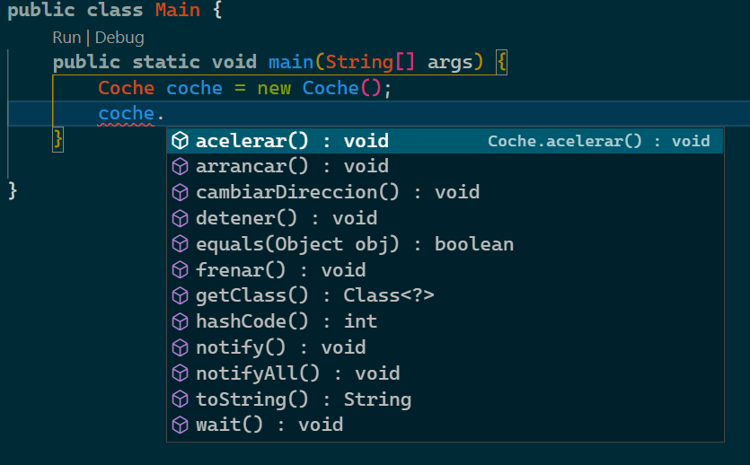

> 👀 En la captura podemos comprobar que el objeto `coche` tiene los métodos de `Vehiculo` y `Coche`, pero no podremos acceder DIRECTAMENTE a los atributos, ya que son privados (tanto los propios como los heredados). Desde el interior de la clase `Coche` podremos acceder a los atributos propios usando `this`, y a los heredados usando los *getters* y *setters*, ya que estos si son públicos. Si los atributos heredados (`color` y `numeroRuedas`) no tuvieran los *getters* ni *setters* y/o no fueran públicos, no tendríamos acceso a los atributos heredados de ninguna forma.

**Los constructores no se heredan**. Cada clase tendrá sus propios constructores. Aunque hay una posibilidad de llamar a los métodos de la superclase (incluidos los constructores). 

Para hacer referencia a los métodos de la superclase, se podrá usar la palabra reservada <kbd>super</kbd>. De la misma forma que con `this` hacemos referencia a los atributos y métodos de ESTA clase, con `super` hacemos referencia a los atributos y métodos de la clase padre (o superclase). Se entenderá mejor el concepto en el siguiente apartado: La sobrescritura.


## Sobrescritura de métodos

Cuando una clase hereda los métodos de la superclase, la implementación de los mismos no siempre de ajustan a los requerimientos de la clase hija. Puede ocurrir que algunos de los métodos heredados deba ser redefinido en la nueva clase para poder cumplir mejor con su funcionalidad.

Por ejemplo, si tenemos definida la clase `Vehículo`, la cual tiene implementado un método `acelerar()`, y ahora creamos la clase `Helicóptero`  la cual hereda de `Vehículo`, deberíamos sobrescribir el método `acelerar()`, ya que tal y como está definido en la clase `Vehículo`, no sería válido para la clase `Helicóptero`, y tendría que volver a definirse en la misma.

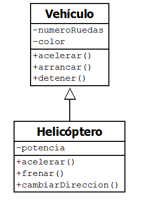

A esta redefinición de métodos heredados en la subclase se le conoce como **sobrescritura de métodos** y su objetivo es **volver a definir en la subclase un método heredado**, respetando el formato original del mismo. Esto significa que el nuevo método tiene que tener exactamente **el mismo nombre, parámetros definidos y valor devuelto definidos en la superclase**. Lo único que podrá modificarse es el modificador de acceso del método, pudiendo ser menor restrictivo que el de la superclase. Por ejemplo, el método sobrescrito puede ser público mientras que el heredado sea privado.

Cuando se hace referencia al método `acelerar()` de la clase Helicóptero, ya no se ejecutará el método heredado `acelerar()` de la superclase Vehículo, si no el que se haya redefinido en la subclase usando la sobrescritura de métodos. Si se hubiese definido el método `acelerar()` de una forma distinta a la que está descrita, por ejemplo, recibiendo más de un parámetro en lugar de ninguno, no produciría ningún error, ya que se trataría de un caso válido de **sobrecarga** de métodos (que lo vemos a continuación 😉), pero dejaría de ser **sobrescritura**.

### Palabra reservada SUPER

Al usar la sobrescritura, es importante entender que no estamos **borrando** el método de la superclase para usar el nuestro propio, si no que lo añadimos y usaremos en su lugar por defecto. Siempre podremos usar los métodos propios usando <kbd>this</kbd> y podremos hacer referencia a la superclase con la palabra reservada <kbd>super</kbd>. Por ejemplo, si hemos sobrescrito el método `.acelerar()` del Vehículo en la clase Helicóptero, desde el interior de la clase Helicóptero podremos hacer `this.acelerar()`, llamando así al método del Helicóptero, y `super.acelerar()` realizará una llamada al método de la clase Vehículo. 

Hay que tener en cuenta que es posible que el método de la superclase no esté adaptado al de la subclase (por algún motivo se sobrescribió), pero es bueno saber que está ahí y que podemos hacer uso de él.

Con `super` también podremos hacer referencias a constructores de la superclase.

```java
public class Animal {
    private String nombre;
    
    public Animal() {}
    
    public Animal(String nombre) {
        this.nombre = nombre;
    }
    
    public void comer() {
		System.out.println("Está comiendo un Animal");
    }
}
```

```java
public class Mamifero extends Animal {
    private int numeroMamas;
    
    public Mamifero(String nombre, int numeroMamas) {
        super(nombre); //Así llamamos al constructor de Animal
        this.numeroMamas = numeroMamas;
    }
    
    @Overrride
    public void comer() {
        System.out.println("Está comiendo un Mamífero");
    }
    
    public void comerPropio(){
        this.comer(); //Así usamos el comer() de ESTA clase
    }
    
    public void comerHeredado() {
        super.comer(); //Así usamos el comer() de la superclase Animal
    }
}
```

Podemos ver que tenemos la clase `Animal` y la clase `Mamífero`, que hereda de `Animal`. 

- Hemos implementado dos métodos en la clase `Mamífero` para hacer llamadas a su método `comer()` con `this`,  y al heredado, con `super`. Es importante ver que aunque se le llame sobrescritura, no estamos “borrando” el método heredado. Siempre podremos usar el de la superclase.
- También podemos ver que en el constructor de `Mamífero`, hemos hecho una llamada al constructor de `Animal`, pasándole los parámetros que necesite. De esta forma podríamos inicializar todos los atributos heredados de golpe (sin necesidad de *setters*), y después ya inicializamos los atributos propios del `Mamífero` de manera tradicional.


## Sobrecarga de métodos

La sobrecarga de métodos consiste en la posibilidad de **definir más de un método con el mismo nombre** dentro de una clase. La sobrecarga de métodos simplifica la utilización de las clases por parte de los programadores puesto que permite disponer de distintas versiones de una operación respetando el mismo nombre de método en todas ellas.

Un ejemplo de sobrecarga sería el de una clase que realizara operaciones matemáticas en la que la suma de números se pudiera realizar de diferentes formas, por ejemplo, una que lo hiciera a partir de los parámetros recibidos, otra a partir de los atributos de la clase y otra que sumara el contenido de una lista; las operaciones serían implementadas por tres métodos diferentes con el mismo nombre pero con diferentes parámetros.

```java
public class Calculadora {
    private int acumulador;

    //Devolvemos la suma de x e y
    public int sumar(int x, int y) {
        return x + y;
    }

	//Devolvemos la suma de x a acumulador
    public int sumar(int x) {
        this.acumulador += x;
        return this.acumulador;
    }

    //Devolvemos la suma de los elementos de la lista
    public int sumar(int[] numeros) {
        int suma = 0;
        for (int n: numeros) {
            suma += n;
        }
        return suma;
    }
}
```

En el ejemplo anterior, vemos que el método `sumar()`, está sobrecargado. Queremos hacer varias operaciones, todas son sumar, pero cada método actúa de una forma diferente. El primero suma dos números, el segundo acumula una cantidad en un atributo, y el tercero recorre un array y suma sus elementos. Los 3 métodos en esencia “suman”, por lo que es una ventaja no tener que cambiarlo de nombre. 

Java sabrá en todo momento qué método es llamado, ya que cada método recibe argumentos diferentes. Si hacemos una llamada al método `sumar(4,6)`, ejecutará el primero. Si llamamos a `sumar(8)` ejecutará el segundo, y si llamamos a `sumar(numeros)`, siendo `numeros` un array definido, ejecutará el tercero. Si llamamos a `sumar("pruebaÉsta")`

La regla que se debe seguir a la hora de sobrecargar métodos en una clase es bastante simple y es que los **métodos sobrecargados deben diferenciarse en el número de parámetros y/o el tipo de los mismos**, siendo irrelevante el tipo de devolución de los métodos.

La sobrecarga no sólo se aplica a métodos; también podemos sobrecargar los constructores de una clase, permitiendo así distintas opciones de inicialización de objetos.

> 💡 Es importante no confundir los conceptos de sobrescritura y sobrecarga. Mientras que el primero consiste en definir de nuevo un método heredado en la superclase “anulando” al anterior, la sobrecarga se basa en tener más de un método con el mismo nombre dentro de la clase (y cada método recibe unos parámetros distintos).


## Polimorfismo

El polimorfismo, en programación orientada a objetos, se refiere a la posibilidad de acceder a un variado rango de funciones distintas a través de la misma interfaz. O sea, un mismo identificador puede tener distintas formas (distintos cuerpos de función, distintos comportamientos) dependiendo del contexto en el que se halle.

Veamos un ejemplo de polimorfismo:

```java
Animal a = new Animal();
Animal b = new Mamifero();
Animal c = new Reptil();
```

`Animal` es la superclase de la que heredan `Mamifero` y `Reptil`. Poseen atributos y métodos en común. Pues todos los objetos creados pueden guardarse en una variable de tipo Animal, puesto que **todas son animales**. También podríamos pasar un `Mamífero` como parámetro en método que tenga como argumento una variable de tipo `Animal`, puesto que `Mamifero` **es un** `Animal`.

> 💡Se podrán guardar variables de un tipo “b” en una variable de tipo “a” siempre que “b” herede de “a”. Siempre para saber si podemos guardar un variable definida como otra clase distinta, nos hacemos la pregunta. ¿La clase “b” **ES UN(A)** “a”?. Por ejemplo, para guardar un objeto Mamífero en una variable de tipo Animal, ¿Un mamífero ES UN animal?. La respuesta es SI, ya que Mamífero hereda de Animal, así que se podrá realizar. ¿Un reptil es un mamífero? NO. Ambas heredan de Animal, pero son clases distintas (hermanos podríamos decir). Así que no podremos crear un objeto de la clase Reptil y guardarlo en una variable de tipo Mamífero, eso provocará un error.

**Un tipo de datos admite valores que sean de otras clases, siempre que sean más concretas y hereden de ella.** Ya sea para albergar valores en variables, para paso de parámetros en una función, etc. 

Otra ventaja es la siguiente:

Imaginemos que la clase Animal tiene un método llamado `comer()`.  Tanto los mamíferos como los reptiles, heredan ese método y lo sobrescriben para adaptarlo a sus clases. 

El objeto `a`, es de la clase `Animal` y tiene los atributos y métodos de la clase `Animal`. Entre ellos `comer()`. 

El objeto `b`, es de la `Animal`, pero en su interior hay un `Mamífero`, y al escribir `b.`, el IDE nos mostrará los métodos y atributos de la clase `Animal` y no tendríamos disponibles los métodos propios de los mamíferos, ya que el objeto no es un `Mamífero`. Aunque si tendríamos disponible el método `comer()` puesto que es de todos los animales.

Al llamar a `a.comer()` estamos llamando al método `comer()` de la clase `Animal`, pero al llamar al método `b.comer()`, estamos llamando al método `comer()` de la clase `Mamífero`. Igual para con `c.comer()`, que ejecutaría el propio método `comer()` del `Reptil`.

Aunque todos los objetos sean `Animal`, cada uno ejecutará su propio método en caso de que lo tengan sobrescrito. Esto es debido a que **en tiempo de edición**, el objeto es un `Animal`, puesto que así se ha definido. Pero en **tiempo de ejecución**, se “transforma” en el objeto real que es, y haría una llamada a sus métodos propios y no los que nos dice el IDE que ejecutaría.

El polimorfismo se entiende mejor con las Colecciones.

# Clases Abstractas

A veces en una clase, no podemos implementar los métodos de una forma concreta, y queremos que sean las clases hijas las que implementen un comportamiento concreto. Por ejemplo: Sabemos que TODOS los animales deberían tener el método `comer()`. Y además queremos que todas las clases que hereden lo sobrescriban para que el método se adapte a como come cada tipo de animal.

Con lo sabemos ahora, podemos hacer el método en la clase Animal, y **esperar** que las clases hijas lo sobrescriban. Pero no es de obligado cumplimiento. Pueden sobrescribirlo, así tendrían su propio método, o pueden no hacerlo, y así ejecutarían lo implementado en la clase Animal, que no estaría adaptado.

Para **OBLIGAR** a una clase a que sobrescriba los métodos heredados existen los métodos abstractos. Cuando definimos un método abstracto, solo le estamos diciendo EL QUÉ debería tener, pero no EL COMO debería funcionar. Por ejemplo, podemos indicarle a la clase `Animal`, que tendrá un método llamado comer(), que no recibe nada y que no retorna nada. Y listo. No escribimos nada de código en el método. En lugar de abrir llaves y escribir código, escribimos la **firma del método** y terminamos con un punto y coma (;).

Y para indicar que ese método es abstracto, debemos indicarlo con la palabra reservada <kbd>abstract</kbd> después del modificador de acceso.

```java
public abstract class Animal {
    ...

    public abstract void comer();
}
```

**Cuando una clase tiene al menos un método abstracto, la clase también deberá declararse como abstracta.** Por esa razón, en cuanto le ponemos el `abstract` en el método `comer()`, el IDE nos obligará a poner `abstract` también en la clase. 

Esto **obligará** a todas las clases que hereden de la clase abstracta, a que tengan que sobrescribir **obligatoriamente** el método abstracto y a definir su comportamiento. Ya no podremos elegir si sobrescribir el método o no. Tendremos que hacerlo. Al forzarlo, nos aseguramos que todos los clases que hereden de la clase abstracta tendrán método el cual estará adaptado a sus necesidades.

Como la clase abstracta puede tener métodos abstractos (es posible que no los tenga), **no se podrán instanciar objetos de una clase abstracta**. Tiene sentido, ya que, ¿que pasaría si hacemos una llamada a un método que no está implementado?. 

>  💡 Al no poderse instanciar objetos de una clase abstracta, es un buen mecanismo para impedir que se creen objetos de una clase genérica, obligando a usar clases más especializadas que tengan sus métodos concretos definidos. Por ejemplo, no queremos que se puedan crear objetos Animal, ya que es muy genérica, así obligamos a que los objetos que usemos sean más específicos.

# Interfaces

En las interfaces se especifica qué se debe hacer pero no su implementación. Serán las clases que implementen estas interfaces las que describen la lógica del comportamiento de los métodos. En otras palabras, **es una “clase” en la que todos sus métodos son abstractos**. 

Una interfaz puede tener atributos, pero deberán ser constantes. Aunque no es muy común.

Las interfaces, al igual que las clases abstractas, **no pueden ser instanciadas.**

Las interfaces se definen de la siguiente forma:

- Se crea un nuevo archivo, como si fuéramos a crear una clase, pero en lugar de `class`, se escribe `interface`:
- Se describe la firma de los métodos y se terminan en ;. No se escribe su implementación. 
- Se considera que todos los métodos son `public` y `abstract` por definición, por lo que no es necesario indicarlo.

``` java
public interface NombreInterfaz {
    public void nombreMetodo1();
    public String nombreMetodo2(int parametro1, double parametro2);
    ...
}
```

**Cualquier clase que implemente la interfaz deberá sobrescribir los métodos abstractos definidos por la interfaz.**

Las interfaces se implementan con la palabra reservada <kbd>implements</kbd>.

```java
public class NombreClase implements NombreInterfaz {
    ...
    
    @Override
    public void nombreMetodo1(){
        // Deberemos implementar los métodos
    }
    
    @Override
    public String nombreMetodo2(int parametro1, double parametro2) {
        // Deberemos implementar los métodos
    }
}
```

Hasta aquí parece que es exactamente lo mismo que usar clases abstractas. Pero hay una gran diferencia.

En Java no existe la herencia múltiple, por lo que una clase solamente puede heredar de UNA clase. Una clase puede heredar de otra, que a su vez hereda de otra, y a su vez de otra, eso se puede perfectamente. Pero simultáneamente no puede heredar de una y de otra. Por lo que no podemos heredar de DOS clases abstractas.

Con las interfaces si. Podemos implementar todas las interfaces que queramos. A esto sumado que también podemos seguir usando la herencia, o no. 

```java
public class NombreClase extends Superclase1 implements Interfaz1, Interfaz2, Interfaz3 {
    ...
}
```

La clase `NombreClase`, hereda de `Superclase1` todos sus métodos y atributos, e implementa todas las interfaces `Interfaz1`, `Interfaz2`, `Interfaz3`. Por lo que estaría obligada a desarrollar TODOS los métodos abstractos que estén definidos en las 3 interfaces.

Otro ejemplo:

```java
public interface Nave {
    public void moverPosicion(int x, int y);
    public void disparar();
}
```

```java
public class NaveJugador implements Nave {
    public void moverPosicion(int x, int y) {
        // Implementamos el método
        this.posActualX -= x;
        this.posActualY -= y;
    }
    public void disparar(){
        // Implementamos el método
        System.out.print("---");
    }
}
```

La clase `NaveJugador`, implementa la interfaz `Nave`, por lo que **debe** sobrescribir los métodos abstractos definidos por la interfaz.

Además podríamos hacer otra interfaz `MotorHiperespacio`, para dotar a nuestra nave de un nuevo método para saltar al Hiperespacio.

```java
public interface MotorHiperespacio {
    public void saltarHiperespacio();
}
```

 ```java
 public class NaveJugador implements Nave, MotorHiperespacio {
    public void moverPosicion(int x, int y) {...}
    public void disparar(){...}
    public void saltarHiperespacio(){...}    
 }
 ```

Podemos entender las interfaces como funcionalidades que le podemos dar a las clases, sin que estas tengan que estar relacionadas entre si a través de la herencia. Por ejemplo, podríamos hacer que una clase que NO ES UNA NAVE, pudiese tener el método para saltar al hiperespacio.

```java
public class Superman implements MotorHiperespacio {
    ...
    public void saltarHiperespacio(){...}  
}
```

Ahora, tanto `NaveJugador`, como `Superman`, que son clases que no tienen ninguna relación de herencia, ambas tienen el método `saltarHiperespacio()`. Porque ambas implementan la interfaz `MotorHiperespacio`, la cual les obliga a implementar su método.

Mezclando las capacidades de la herencia, las clases abstractas y las interfaces, podremos crear esquemas jerárquicos complejos, reaprovechando código de una forma muy eficaz. 


