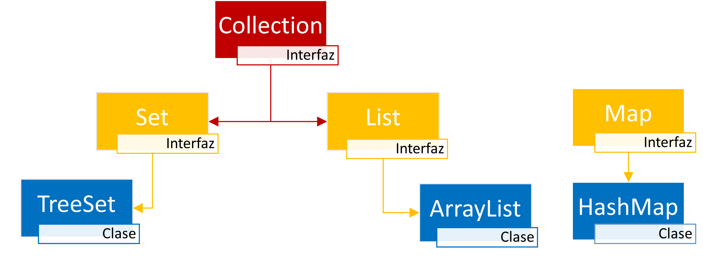

# Índice

[TOC]

------

# Introducción

Una colección en Java, es un objeto que agrupa múltiples elementos dentro de otro objeto. Las colecciones implementan diferentes comportamientos de almacenamiento, recuperación y navegación.

Se utilizan para organizar los datos y acceder a ellos de una forma rápida (ya que están en memoria), pudiendo insertar, actualizar, obtener y eliminar elementos. 

Son similares a los arrays, pero estos tienen las siguientes limitaciones:

- Los arrays tienen un tamaño fijo. No pueden cambiar de forma dinámica su tamaño. Ni aumentan, ni disminuyen.
- No proveen distintas formas de almacenar o acceder a los datos.
- No poseen formas automáticas de ordenación. 

Para superar dichas limitaciones, utilizamos las Colecciones. 

Las colecciones nos ofrecen los siguientes beneficios:

- Menos esfuerzo al manejarlas: Ya poseen una estructura de datos y algoritmos para agrupar, ordenar, insertar, borrar, y buscar sus elementos.
- Fácil de aprender: Gastamos menos tiempo para comprender la lógica para agrupar y ordenar una colección, que si lo hiciéramos manualmente de otra forma.
- Mejoran la calidad del código: Usamos clases que ya están muy probadas y refinadas en su funcionamiento y eficiencia.
- Reusabilidad: Una colección se puede usar incluso para API diferentes formando un lenguaje común para pasar objetos.

# Vista general

El esquema de colecciones de Java es muy complejo, y veremos tan solo algunas implementaciones de las interfaces más comúnmente usadas.



- Interfaz **`List`**: Su implementación más usada es la clase **`ArrayList`**.
- Interfaz **`Set`**: Su implementación más usada es la clase **`TreeSet`**.
- Interfaz **`Map`**: Su implementación más usada es la clase **`HashMap`**.

# Operaciones comúnes

## Métodos

Todas las colecciones poseen unas operaciones básicas comunes. Después cada colección posee sus propios métodos particulares. Las operaciones básicas para todas las colecciones son las siguientes:

- Añadir un objeto a la colección. Se realiza con el método <kbd>add</kbd>.
- Borrar un objeto de la colección. Se realiza con el método <kbd>remove</kbd>. 
- Obtener el tamaño de la colección. Se realiza con el método <kbd>size</kbd>.
- Comprobar si un objeto se encuentra en la colección. Se realiza con el método <kbd>contains</kbd>.
- Comprobar su una colección está vacía. Se realiza con el método <kbd>isEmpty</kbd>.
- Obtener un elemento de la colección. Se realiza con el método <kbd>get</kbd>.
- Eliminar todos los elementos de la colección. Se realiza con el método <kbd>clear</kbd>.

Cada colección sobrescribirá sus propios métodos, adaptándolos a sus necesidades, pudiendo existir diferencias entre una colección y otra, por lo que siempre consultaremos la documentación de los mismos, para comprobar que hace cada método, sus valores devueltos, posibles excepciones lanzadas, etc.

## Bucle FOR EACH

Es un bucle especial, que no lo vimos en el momento de las estructuras repetitivas, y ahora es el momento. Está especialmente diseñado para recorrer colecciones y arrays, y con el que no necesitamos manejar ningún índice, tal y como hacemos con el `for` tradicional. Su sintaxis es la siguiente:

```java
for (TipoDato objeto : nombreColección ) {
    instrucciones...
}
```

Veamos un ejemplo concreto para mostrar todos los elementos de un array de Strings.

```java
String[] nombres = {"Tony", "Bruce", "Peter", "Natasha", "Steve", "Clint"};
for (String nombre : nombres) {
    System.out.println(nombre)
}
```

El bucle `for…each` anterior imprimiría en cada vuelta, los nombres del array en orden secuencial. No tendríamos que manejar un índice ni incrementarlo para poder acceder a los elementos por su posición, lo cual nos puede ahorrar muchos errores de acceso a índices erróneos. 

Si necesitamos recorrer el array o colección de una forma que no sea estrictamente secuencial, por ejemplo, recorrerla al revés, o de dos en dos, como necesitamos acceder a posiciones concretas del array, no podríamos usar el `for…each` y necesitaríamos un `for` tradicional y para poder manejar el índice.

# List

Son colecciones basadas en índices, como los arrays (de ahí su nombre), que permiten duplicados y se almacenan en base a una posición. 

La implementación más común de la Interfaz **List**, es la clase **[ArrayList](https://docs.oracle.com/javase/8/docs/api/java/util/ArrayList.html)**. También existe **[LinkedList](https://docs.oracle.com/javase/8/docs/api/java/util/LinkedList.html)** la cual ofrece mejor rendimiento en determinadas circunstancias.

Su sintaxis es la siguiente:

```java
List<Objeto> nombreColección = new ArrayList<>();
```

Creamos un nuevo objeto del tipo `ArrayList` y debemos parametrizar el tipo de dato que albergará la colección. 

> **Nota:** Si no parametrizamos la colección con <>, estaremos creando una colección de Object, lo cual nos permitiría crear una colección de cualquier tipo de objeto todos mezclados. Se recomienda encarecidamente siempre crear una colección de un tipo de objeto determinado.

Veamos un ejemplo para crear un ArrayList de Strings.

```java
List<String> lista = new ArrayList<>();
```

> 🤓 Se considera una buena práctica para el uso de colecciones, el declarar la variable del tipo de la interfaz (`List`) que es más genérico, e inicializarla con el nombre de la especialización (`ArrayList`). De esta forma, en la misma variable `lista`, podremos guardar un ArrayList, o cualquier otro objeto que implemente la interfaz List, como un LinkedList. **Haremos lo mismo para todas las demás colecciones.**
>
> 🤓 Además, en la inicialización, podemos omitir la clase parametrizada, pudiendo dejar `new Colección<>();`, siendo Colección la clase que implementa la interfaz, sea ArrayList, TreeSet o HashMap.

Así estamos creando el objeto `lista`, que será un `ArrayList`, que contendrá `String`. Inicialmente se crea un ArrayList vacío, y deberemos añadirle elementos con el método <kbd>add</kbd>. Como le hemos indicado que será una colección de `String`, el método `add` sólo admitirá objetos de esa clase.

```java
// Añadimos objetos a la lista
lista.add("Tony");
lista.add("Bruce");
lista.add("Clint");
lista.add("Steve");
lista.add("Natasha");
lista.add("Peter");
lista.add(2, "Thanos"); // Se inserta en la posición 2, moviendo todos los índices siguientes
```

Cada vez que insertamos un elemento con `add(objeto)`, este se posiciona al final de la lista. También podemos usar el método sobrecargado `add(índice, objeto)`, que le pasamos el índice donde insertar el objeto, y lo que hace es sumarle un 1 a todos los índices siguientes.

Para acceder a los elementos de la lista, usaremos el método <kbd>get</kbd>, el cual recibe un entero que representa el índice (posición) del elemento dentro del ArrayList. Sus índices empiezan en 0, igual que los arrays.

```java
System.out.println(lista.get(2)); // Clint
```

Para borrar los elementos, podemos hacerlo de dos formas, gracias a la sobrecarga del método `remove()`

```java
// Borramos por índice
lista.remove(2); // Borraría a Thanos
// Borramos por objeto
lista.remove("Natasha"); // Borraría a Natasha. Da igual en que posición estuviese
// Borramos todo
lista.clear(); // Borra a todos los elementos
```

La colección List, posee todos los métodos comunes que hemos descrito con anterioridad, como `contains`, `isEmpty`, `clear`, `remove`, etc. Lo mejor siempre para comprobar los métodos de una colección será crear el objeto y escribir su nombre  y un punto para que el IDE nos muestre la lista de todos los métodos disponibles, así como la documentación de como usarlos.


## Características

- Son de propósito general y muy versátiles en todos los aspectos
- Están basadas en índices
- Admiten duplicados
- No tienen un orden natural por defecto
- Acceso directo por posición
- Son muy parecidos a los arrays, y por eso familiares para todos los programadores

# Set

La colección Set tiene como principal característica que no admite duplicados y que algunas de sus implementaciones mantienen sus elementos ordenados. Su implementación más común es la clase **[TreeSet](https://docs.oracle.com/javase/8/docs/api/java/util/TreeSet.html)**. También existe la clase **[HashSet](https://docs.oracle.com/javase/8/docs/api/java/util/HashSet.html)**, que es más rápida que la clase TreeSet, pero no es muy versátil.

Su sintaxis es la siguiente:

```java
Set<Objeto> nombreColección = new TreeSet<>();
```

Veamos el ejemplo para crear un TreeSet de enteros.

```java
Set<Integer> numeros = new TreeSet<>();
numeros.add(8);
numeros.add(12);
numeros.add(12); // No lo añade. add devuelve false.
numeros.add(-4);
int elementos = numeros.size(); // elementos = 3
System.out.println(numeros); // [-4, 8, 12]
```

> **Nota**: Al parametrizar una colección siempre deberemos indicar una clase, por lo que si queremos hacer una colección de tipos primitivos, deberemos usar sus clases envoltorio. 

> **.toString()** La mayoría de las colecciones tienen sobrescrito el método `.toString()`, de forma que podemos imprimir directamente el objeto y veríamos el contenido de las mismas de una forma rápida sin tener que recorrerlas manualmente.

La gran ventaja que presentan los `TreeSet` frente a los `ArrayList`, es que **no permiten duplicados**, por lo que la colección `numeros`, no  tendría 2 veces el valor `12`. Y otra ventaja es que mantiene el orden natural de los elementos. Es decir, sus elementos estarán ordenados de menor a mayor si son números y alfabéticamente si son String. Da igual el orden de inserción.

Pero ahora nos salta una duda, expongamos el problema. Tengo la siguiente clase:

```java
public class Persona {
    private String nombre;
    private int edad;
    ...
}
```

Y ahora hago una colección de la Personas. Hasta aquí todo normal.

````java
Set<Persona> lista = new TreeSet<Persona>();
lista.add(new Persona("Tobey", 46));
lista.add(new Persona("Tom", 25));
lista.add(new Persona("Andrew", 38));
````

Las preguntas son:

- ¿Como sabe Java si una persona es igual a otra para añadirla o no a la lista? 
- ¿Qué criterios usará para ordenarla? 
- ¿Ordena alfabéticamente por nombre? ¿Ordena numéricamente por edad? 
- ~~¿Qué Spiderman te gusta más?~~

La respuesta a la primera pregunta es que **NO SABE HACERLO**, por lo que dará un fallo y no hará nada de lo siguiente.

**Para poder hacer una colección TreeSet, el objeto deberá implementar la interfaz <kbd>Comparable</kbd>**. Al implementarla, nos obligará a desarrollar un método llamado `compareTo`, el cual decidirá si un objeto de su misma clase es **menor, igual o mayor** que otro recibido. Nosotros deberemos escribir la lógica de la comparación eligiendo el criterio que queramos. Por ejemplo, podremos decidir si *Andrew* es menor que *Tom* por que alfabéticamente va antes, o si *Tom* debería ir el primero en la lista, por ser el ~~mejor~~ más joven.

El método `compareTo` recibirá una objeto de la misma clase (Persona en nuestro ejemplo), y retornará un entero. Ese entero deberá seguir los siguientes criterios:

- Será negativo si el objeto que invoca el método es menor que el objeto recibido.
- Será 0 si el objeto que invoca el método es igual que el objeto recibido.
- Será positivo si el objeto que invoca el método es mayor que el objeto recibido.

Solo tenemos que sobrescribir el método. Las llamadas y las comparaciones las hará de forma interna el TreeSet al hacer una inserción con `add`.

Supongamos que lo queremos es ordenar las personas por edad. Primero el más joven. Pues compararemos los atributos edad de los objetos en el `compareTo`.

Ya terminado sería:

```java
public class Persona implements Comparable<Persona> {
    private String nombre;
    private int edad;
    ...
    @Override
    public int compareTo(Persona otraPersona) {
        return this.edad - otraPersona.edad;
    }
}

```

Al restar las edades, ya tenemos justo los valores que queremos. 

- Si ESTA clase es menor que la recibida por parámetros, nos dará un número negativo (da igual cual). 
- Si ESTA clase es mayor que la recibida por parámetros, dará un número positivo. 
- Y si tienen las mismas edades, el resultado será 0. 

De esta forma, el TreeSet podrá comparar los objetos entre si y saber el orden (que hemos decidido nosotros) para insertar los elementos en unas posiciones u otras, o bien no insertarlos porque son iguales. 

> ⚠ `TreeSet` para comprobar la igualdad de dos objetos no usa el `.equals()` ni el `hashcode()`, si no el `compareTo()`. Por lo que hay que tener en cuenta que dos personas distintas, con distintos nombres PERO CON LA MISMA EDAD, el TreeSet entendería que son iguales, por lo que no la insertaría en la colección. 

Todavía nos queda una duda… ¿Por qué en las colecciones que hicimos de ejemplo inicialmente con `Integer` o `String` no tuvimos que hacer nada? La respuesta es simple. Es que esas clases ya tienen la interfaz `Comparable` implementada, lo que lleva a que tienen el método `compareTo` sobrescrito, y así el TreeSet si sabe como compararlos. Ese trabajo que nos ahorramos.


## Características

- No admiten duplicados
- Están ordenados. Deben implementar la interfaz Comparable.
- No permiten acceso aleatorio. Sólo secuencial.
- No permiten acceso por índice.


# Map

Las colecciones que implementan la interfaz `Map`, están basadas en pares de `clave-valor`. Cada par de clave-valor se llama **entrada**. 

- La *clave* es un objeto que identifica a una entrada.
- El *valor* es un objeto que contiene el valor asociado a la clave. 

Podríamos decir que en un `ArrayList<Persona>`, el valor sería el objeto Persona, y la clave sería el índice que es un entero SIEMPRE. La ventaja de los Map es que en lugar de un entero para el índice, podemos usar otro objeto cualquiera para poder acceder a la Persona, pudiendo asociar como clave un char, un String u otro objeto más complejo.

La implementación más común de la interfaz Map es **`HashMap`**. 

Su sintaxis es la siguiente:

```java
Map<Clave, Valor> nombreColección = new HashMap<>();
```

Donde Clave y Valor son las clases que representarán a la clave y al valor dentro del Map. Veamos un ejemplo de código:

Vamos a crear una colección con los personajes de [Reservoir Dogs](https://es.wikipedia.org/wiki/Reservoir_Dogs#Reparto_y_personajes).

Creamos primero la clase Actor:

```java
public class Actor {
    private String nombre;
    private String personaje;
    ...
}
```

```java
Map<String, Actor> reparto = new HashMap<>();
reparto.put("BLANCO", new Actor("Harvey Keitel", "Larry"));
reparto.put("NARANJA", new Actor("Tim Roth", "Freddy"));
reparto.put("ROSA", new Actor("Steve Buscemi", "Michael"));
reparto.put("RUBIO", new Actor("Michael Madsen", "Vic Vega"));
reparto.put("AZUL", new Actor("Edward Bunker", "Jack"));
reparto.put("MARRON", new Actor("Quentin Tarantino", "Tommy"));
reparto.put("MARRON", new Actor("Tarantinoooor", "Tommy")); // Se inserta, sustituyendo al anterior.
```

> **✏** Para añadir elementos a la colección HashMap, deberemos usar el método <kbd>put(clave,valor)</kbd> que recibe un objeto con la clave y otro objeto con el valor. El método devuelve un `null` si no había un valor previo asociado a la clave (es decir, si es una entrada nueva), o en casi de si existir, devuelve el valor previo (el valor que borrará de la colección, ya que será sustituido por el nuevo valor). Por esta razón, no existirán nunca claves duplicadas. 

Otros ejemplos de métodos útiles serían:

```java
// Acceder a elementos por su clave
reparto.get("ROSA"); // retorna -> Actor {nombre=Steve Buscemi, personaje=Michael}
// Borrar elementos
reparto.remove("RUBIO"); // retorna -> Actor {nombre=Michael Madsen, personaje=Vic Vega}
// Buscar elementos
reparto.containsKey("VERDE"); // retorna -> false
```

Internamente los HashMap utilizan dos tablas, una para las claves y otra para los valores. Se puede acceder a ambas tablas a través de los métodos `keySet()` y `values()`, respectivamente. Y podemos recorrer la colección iterando sobre las claves o los valores, según nos convenga.

Ejemplo de recorrer un HashMap con un bucle `for each`:

```java	
// Iterando sobre sus claves
for (String clave : reparto.keySet()) {
    Actor actor = reparto.get(clave);
    System.out.println(actor.getPersonaje() + " (interpretado por " + actor.getNombre() + ")");
}
```

```java
// Iterando sobre sus valores
for (Actor actor : reparto.values()) {
    System.out.println(actor.getPersonaje() + " (interpretado por " + actor.getNombre() + ")");
}
```

Ya es decisión de usar la forma que mejor se adapte a la lógica de nuestra aplicación. Por ejemplo, si sólo queremos mostrar los actores, en nuestro ejemplo sería más simple iterar sobre sus valores, ya que no usamos sus claves, pero si hubiésemos querido mostrar su clave (para mostrar el apodo que tenían en la película), en el segundo `for` no tenemos la clave por ningún sitio. Es importante conocer las distintas formas y después elegir.

## Características

- No admiten claves duplicadas. Valores duplicados si.
- Permiten búsqueda rápida por clave.
- Flexibilidad al tener claves y valores de distintos tipos.


# ¿Cual colección usar?

Entre tantas colecciones, es posible que a veces no tengamos claro cual usar que se adapte mejor a las necesidades, tanto en funcionamiento como en eficiencia. El siguiente cuadro te ayudará a escoger la más adecuada. 

Algunas clases o interfaces no se han visto en el curso. Pero si se ajustan a lo que necesitas, y conociendo las bases de las colecciones, verás que no es nada difícil aprender a manejar una nueva, ya que seguro que comparten muchos métodos y comportamientos con otra que si conoces.


