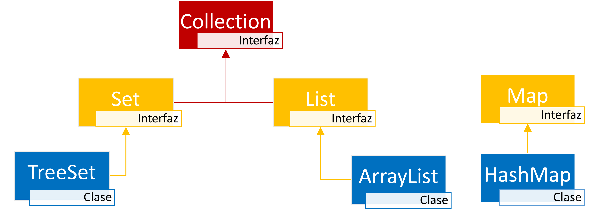
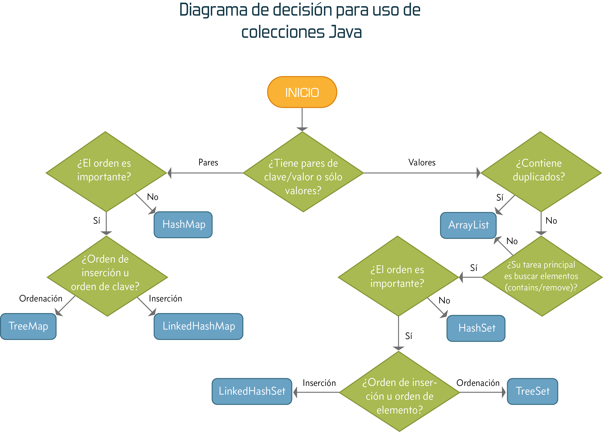

# Índice

[TOC]

------

# Introducción

Una colección en Java, es un objeto que agrupa múltiples elementos dentro de otro objeto. Las colecciones implementan diferentes comportamientos de almacenamiento, recuperación y navegación.

Se utilizan para organizar los datos y acceder a ellos de una forma rápida (ya que están en memoria), pudiendo insertar, actualizar, obtener y eliminar elementos. 

Son similares a los arrays, pero estos tienen las siguientes limitaciones:

- Los arrays tienen un tamaño fijo. No pueden cambiar de forma dinámica su tamaño. Ni aumentan, ni disminuyen.
- No proveen distintas formas de almacenar o acceder a los datos.
- No poseen formas automáticas de ordenación. 

Para superar dichas limitaciones, utilizamos las Colecciones. 

Las colecciones nos ofrecen los siguientes beneficios:

- Menos esfuerzo al manejarlas: Ya poseen una estructura de datos y algoritmos para agrupar, ordenar, insertar, borrar, y buscar sus elementos.
- Fácil de aprender: Gastamos menos tiempo para comprender la lógica para agrupar y ordenar una colección, que si lo hiciéramos manualmente de otra forma.
- Mejoran la calidad del código: Usamos clases que ya están muy probadas y refinadas en su funcionamiento y eficiencia.
- Reusabilidad: Una colección se puede usar incluso para API diferentes formando un lenguaje común para pasar objetos.

# Vista general

El esquema de colecciones de Java es muy complejo, y veremos tan solo algunas implementaciones de las interfaces más comúnmente usadas.

- Interfaz **`List`**: Su implementación más usada es la clase **`ArrayList`**.
- Interfaz **`Set`**: Su implementación más usada es la clase **`TreeSet`**.
- Interfaz **`Map`**: Su implementación más usada es la clase **`HashMap`**.

# Métodos comunes

Todas las colecciones poseen unas operaciones básicas comunes. Después cada colección posee sus propios métodos particulares. Las operaciones básicas para todas las colecciones son las siguientes:

- Añadir un objeto a la colección. Se realiza con el método <kbd>add</kbd>.
- Borrar un objeto de la colección. Se realiza con el método <kbd>remove</kbd>. 
- Obtener el tamaño de la colección. Se realiza con el método <kbd>size</kbd>.
- Comprobar si un objeto se encuentra en la colección. Se realiza con el método <kbd>contains</kbd>.
- Comprobar su una colección está vacía. Se realiza con el método <kbd>isEmpty</kbd>.
- Obtener un elemento de la colección. Se realiza con el método <kbd>get</kbd>.
- Eliminar todos los elementos de la colección. Se realiza con el método <kbd>clear</kbd>.

Cada colección sobrescribirá sus propios métodos, adaptándolos a sus necesidades, pudiendo existir diferencias entre una colección y otra, por lo que siempre consultaremos la documentación de los mismos, para comprobar que hace cada método, sus valores devueltos, posibles excepciones lanzadas, etc.

# List

# Set

# Map

# ¿Cual colección usar?

Entre tantas colecciones, es posible que a veces no tengamos claro cual usar que se adapte mejor a las necesidades, tanto en funcionamiento como en eficiencia. El siguiente cuadro te ayudará a escoger la más adecuada. 

Algunas clases o interfaces no se han visto en el curso. Pero si se ajustan a lo que necesitas, y conociendo las bases de las colecciones, verás que no es nada difícil aprender a manejar una nueva, ya que seguro que comparten muchos métodos y comportamientos con otra que si conoces.

